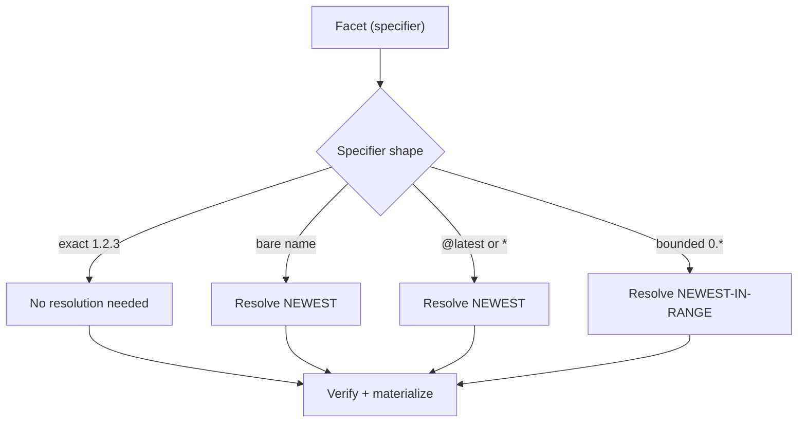
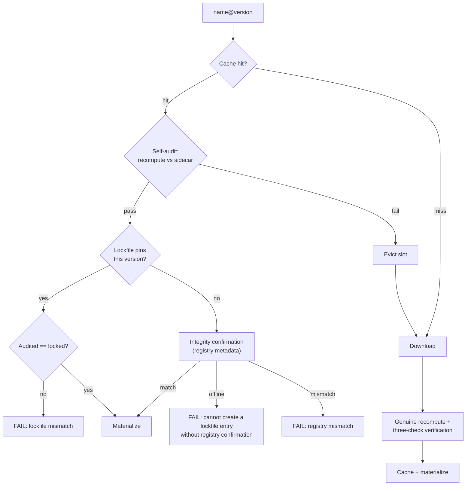
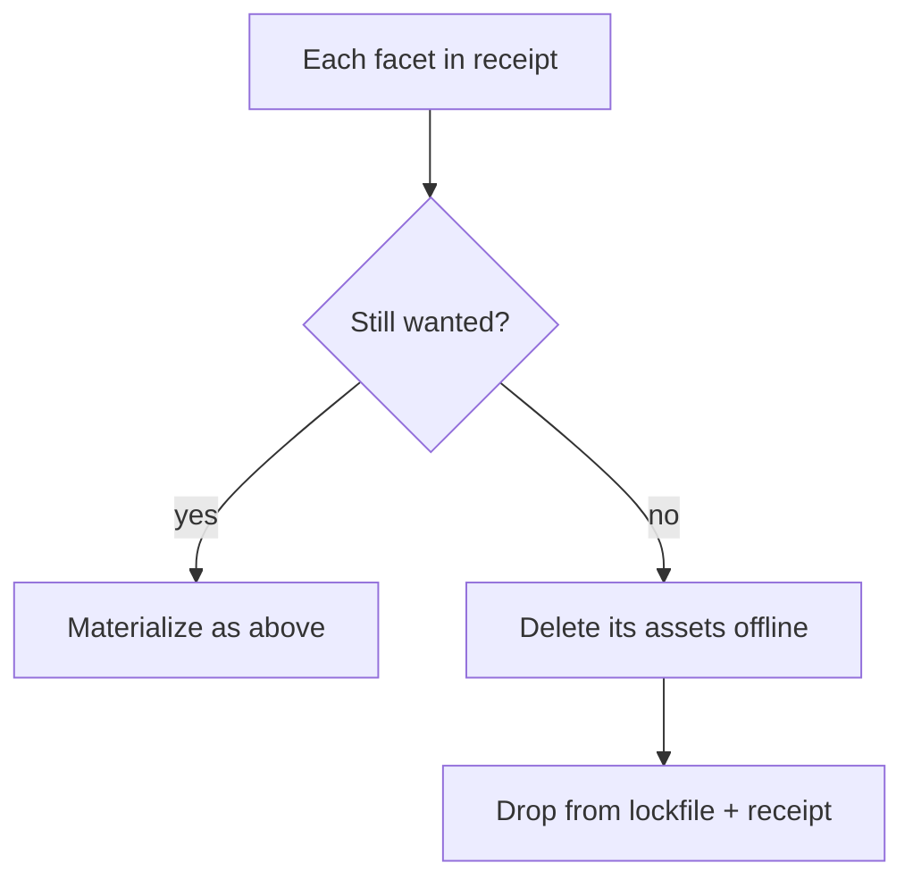
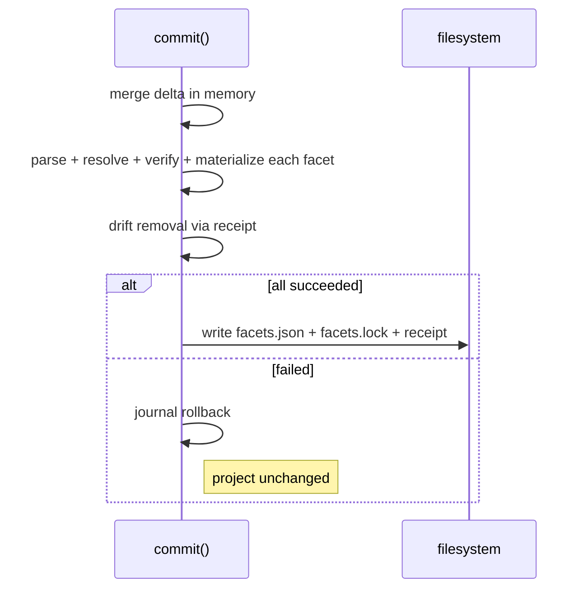

import { DeltaTip, InstallReceiptTip, CanonicalFingerprintTip, SidecarTip } from "/snippets/glossary.jsx";

Commit is phase 2 of the [install pipeline](/specification/install): a single transaction that applies the <DeltaTip>delta</DeltaTip> from [Planning](/specification/planning). Its inputs are the on-disk `facets.json`, `facets.lock`, the <InstallReceiptTip>install receipt</InstallReceiptTip>, and the delta. It is never partial: a failure anywhere MUST roll back all materialization via the **journal** — a log in which every materialization write records its inverse operation, replayed in reverse on failure — and leave the project exactly as it was.

<CardGroup cols={3}>
  <Card title="Verify" icon="shield-check">
    Cache self-audit, lockfile comparison, or registry confirmation. Tampered content never materializes.
  </Card>
  <Card title="Materialize" icon="download">
    Assets written to every selected adapter, journaled for rollback.
  </Card>
  <Card title="Commit" icon="check">
    `facets.json` + `facets.lock` + receipt written together, atomically.
  </Card>
</CardGroup>

## Sequence

<Steps>
  <Step title="Load state and gate">
    The manifest is read, the **install lock** — a per-project advisory lock ensuring only one install operates on a project at a time — is acquired, and the lockfile and receipt are loaded (an invalid receipt is re-bootstrapped from the lockfile; receipt asset entries with crafted names are reported and skipped individually). A delta naming the same facet in both additions and removals MUST be rejected, the adapters selected for this operation MUST pass the adapter API compatibility preflight — a defense-in-depth re-check behind the command-level gate that already rejected any incompatible installed adapter before planning; a selected adapter whose declared adapter API the CLI does not support MUST fail the commit here, before the per-facet loop and therefore before any Git or local facet build can invoke adapter metadata methods — and the frozen gates run (see [Frozen lockfile](#frozen-lockfile)). Failures here touch nothing — no rollback is needed.
  </Step>
  <Step title="Merge delta in memory">
    Additions are upserted, removals are deleted — all in memory. The on-disk `facets.json` MUST NOT be written ahead of the install.
  </Step>
  <Step title="Per-facet loop">
    Each facet in the **desired set** — the manifest's facets after the delta is merged in memory — passes four sub-stages: [parse → resolve → verify → materialize](#the-per-facet-loop). The loop stops at the first failure.
  </Step>
  <Step title="Drift removal">
    The receipt is compared against the desired set: any facet still on disk but no longer wanted has its assets deleted — entirely offline.
  </Step>
  <Step title="Transactional tri-write">
    The [manifest-write policy](#manifest-write-policy) is applied just before the write, then `facets.json`, `facets.lock`, and the receipt are written together. A failure anywhere rolls back all materialization and leaves all three files unchanged.
  </Step>
</Steps>

## Registry interactions

Commit makes three distinct kinds of registry interaction, gated independently. The wire protocol behind them — endpoints, request and response shapes — is owned by the registry's own API specification and is out of scope for this document.

**Version resolution** determines the exact version a specifier refers to (turning `0.*`, `*`, `latest`, or a bare name into a concrete `X.Y.Z`). Needed **only when no exact version is already known** — an exact specifier needs none; a satisfying lockfile entry needs none. When it does fire, the metadata response also carries the published fingerprint, so integrity confirmation rides version resolution for free.

**Archive resolution** downloads the archive bytes for an exact `name@version`. Needed **only on a cache miss** — a warm cache skips it entirely, regardless of how the exact version was obtained.

**Integrity confirmation** verifies the cached or downloaded content against the registry's published <CanonicalFingerprintTip>canonical fingerprint</CanonicalFingerprintTip> (`content_integrity`). Needed **only when a lockfile entry is being created or replaced** — a satisfying lockfile entry serves as the trust anchor instead. An unreachable registry MUST fail the operation rather than write an unconfirmed entry.

These combine independently: a facet may need any combination, or none. The cache short-circuits archive resolution; a satisfying lockfile entry short-circuits integrity confirmation.

<Info>
Registry versions are immutable — the bytes for a published `name@version` never change. Integrity confirmation and lockfile comparison enforce this invariant **client-side** rather than assuming it.
</Info>

## The per-facet loop

Every facet in the desired set passes the same four sub-stages, in order. The loop is interleaved — facet A is resolved and materialized before facet B starts — and stops at the first failure.

### Parse

The manifest is a `name → value` map, and each value is re-parsed per facet. For a registry entry the value is a bare version specifier (`1.2.3`, `1.*`, `1.2.*`, `*`, `latest`) and the facet name lives in the key, so the full source is reconstructed as `name@specifier`. For git and local entries the value is a self-contained source string (URL, `file:` path) and the key is just a label.

### Resolve

Whether the lockfile is trusted for version resolution depends on **how an entry is requested**, not on a flag:

**Implicit version request** — the lockfile is **NOT trusted** for version resolution. A non-exact specifier during an `add` (`foo-facet`, `foo-facet@1.*`, `foo-facet@latest`) always triggers resolution to the newest matching version, **even when the lockfile already satisfies it**. The user explicitly asked for this version or range — the request is honored.

**Explicit version request** — the lockfile **IS trusted** when satisfying a version (`foo-facet@2.0.1`). A satisfying recorded version needs no version resolution; only an absent or stale entry triggers it. The facet was already declared — the locked state is reproduced.

The **exact-version gate** then decides whether the network fires at all: a satisfying lockfile entry supplies the exact version (no resolution), an exact specifier supplies it directly, and only a non-exact, unlocked specifier resolves fresh against the registry.

### Verify

Once a fully-qualified version is in hand, the cache and integrity path is identical regardless of how the version was obtained. The hash domains and guarantees behind these checks are defined in the [Integrity Model](/specification/integrity).

<Note>
A cache hit is **never taken at face value**. The self-audit always runs on the hit path, followed by exactly one anchor check: lockfile comparison when the lockfile pins this version, integrity confirmation when it does not. The two anchor checks are mutually exclusive.
</Note>

<Steps>
  <Step title="Cache self-audit">
    Recompute the cached content's hashes (per-asset and canonical archive) against the <SidecarTip>integrity sidecar</SidecarTip> (`cache-integrity.json`) written at populate time. A failure MUST **evict the slot**; the chain is retried exactly once as a download. Tampered content MUST NOT be materialized.
  </Step>
  <Step title="Lockfile comparison">
    When the lockfile pins this version, the audited integrity MUST equal the locked integrity (string comparison). A mismatch MUST fail the commit — the highest-priority check, never a silent re-download.
  </Step>
  <Step title="Integrity confirmation">
    When **no** satisfying lockfile entry exists, the audited integrity MUST equal the registry's published `content_integrity`. An unreachable registry MUST fail the commit: a lockfile entry is never written on trust.
  </Step>
</Steps>

On a miss, the downloaded content's canonical fingerprint MUST be **genuinely recomputed** from the extracted bytes (per-asset hashes plus the canonical-archive hash) — never taken from the build manifest's self-declared claim. The recomputed value MUST be verified against the registry's published `content_integrity` and, when the lockfile pins this version, against the locked integrity, before the verified content populates the cache.

#### Git and local sources

Git and local facets are **built from source** during commit rather than downloaded as archives, and each has its own verification contract:

**Git** — the lockfile pins the resolved **commit SHA** (the ref stays in `facets.json`); a clone that cannot be resolved to a commit MUST fail the install. A locked entry is served cache-first: the slot is self-audited against its sidecar, and an audited hit that contradicts the locked integrity is the same hard failure as the registry path. On a miss, the clone is pinned to the locked commit, built, and held to a **one-check reproduction guard**: the built content MUST hash to the locked integrity, or the install fails — the tag-move defense. Registry-style integrity confirmation does not apply to git sources.

**Local** — trust-by-path: the source is containment-checked, rebuilt from disk on every install, and the lockfile follows what is on disk (no integrity confirmation, no caching). The exception is frozen mode, which promises bit-for-bit reproduction: the built content MUST hash to the locked integrity or the install fails, and the entry is never rewritten.

### Materialize

Materialization writes assets from verified content into each selected adapter's storage. Writes are skip-if-identical — a facet whose lockfile entry is unchanged but whose on-disk assets needed rewriting is reported as *repaired* (the full outcome taxonomy is documented at [`facet install`](/cli/install#outcomes)). Every write MUST journal its inverse operation for rollback.

## Lockfile shape

Commit writes `facets.lock` as part of the tri-write: per facet, the tagged source provenance, the exact resolved version, the verified integrity, and the contributed asset tuples. The full schema is specified in [Lockfile](/specification/lockfile).

## Machine-local install receipt

Receipts are per-project, machine-local records stored outside the project's version-controlled tree ([`$FACET_DIR`](/cli/env)`/receipts/`). They track what has been materialized so drift removal can clean up correctly — even when the lockfile no longer mentions the facet.

<CardGroup cols={2}>
  <Card title="Per-project isolation" icon="folder">
    Each project has its own receipt, identified by a hash of the project's canonical path. Two projects never share a receipt.
  </Card>
  <Card title="Self-identifying" icon="fingerprint">
    The receipt embeds the canonical path. A mismatch on load MUST fail closed — treated as absent and re-bootstrapped from the lockfile.
  </Card>
  <Card title="Untrusted input" icon="shield">
    Asset entries with crafted names (path traversal, backslashes) are **reported and skipped individually** — the rest of the receipt still loads and is processed.
  </Card>
  <Card title="Contained deletion" icon="box">
    Deletion goes through adapters using validated **asset tuples** — `(scope, type, name)` triples, the adapter-agnostic identity of a materialized asset — never raw filesystem paths taken from the receipt.
  </Card>
</CardGroup>

## Drift removal

After the loop, the receipt is compared against the desired set. Any facet the receipt shows as installed — but that is no longer wanted — has its assets deleted. The comparison runs against the **receipt**, not the on-disk lockfile; this is what makes **orphan-on-pull** recoverable (a facet whose lockfile entry vanished because a teammate removed it and you pulled — the receipt still remembers the local materialization). Lockfile entries missing from a freshly-bootstrapped receipt are caught too. And because the asset tuples to delete come from the receipt itself, removal needs no cache and no network.

Drift removal runs **before** the tri-write, but its deletions MUST be journaled like every other write — if the commit fails afterward, rollback restores them.

## Manifest-write policy

The manifest value written for an addition depends on the specifier shape. The policy is applied in memory just before the tri-write — never earlier:

| Specifier                                | Manifest value                     | Lockfile value             |
|------------------------------------------|------------------------------------|----------------------------|
| Bare name (no version)                   | Pinned to resolved exact (`1.2.3`) | Resolved exact + integrity |
| Explicit (`1.2.3`, `0.*`, `0.1.*`, `*`, `latest`) | Written verbatim                   | Resolved exact + integrity |
| Reproduction (not an addition)           | Unchanged                          | Unchanged or re-resolved   |

## Transactional tri-write

On success, three files MUST be written together: the project manifest, the lockfile, and the receipt. A failure anywhere MUST leave all three exactly as they were.

<Note>
A failed operation leaves the project exactly as it was — no snapshot/restore needed.
</Note>

## Frozen lockfile

{/* this bucks the <code> wrapping because the `--` gets smushed into a — in mintlify */}
Frozen mode (the [`--frozen-lockfile`](/cli/install#param-frozen-lockfile) flag) treats the lockfile as the complete, authoritative source of truth.

<Warning>
A frozen commit with a non-empty delta (any addition or removal) MUST be rejected immediately. Only a plain `facet install` can run frozen.
</Warning>

The system MUST check bidirectional consistency before touching anything: every manifest facet MUST have a satisfying lockfile entry, the lockfile MUST NOT pin anything the manifest dropped, and git/local sources MUST match their locked provenance.

| Behavior                         | Frozen mode                                          |
|----------------------------------|------------------------------------------------------|
| Additions or removals            | Rejected                                             |
| Version resolution               | Forbidden — absent/stale entry fails immediately     |
| Integrity confirmation           | Never fires (no entry creation)                      |
| Archive resolution               | Allowed (downloading locked content is reproduction) |
| Bidirectional consistency        | Required (manifest ↔ lockfile)                       |
| Integrity before materialization | Required for every facet (including local sources)   |
| Drift removal                    | Runs; receipt is rewritten                           |
| Lockfile write                   | Never                                                |
| Manifest write                   | Never                                                |

## Not in the install flow

- **Text asset resolution** — text is in the archive. No install-time fetching.
- **Disk layout** — determined by adapters, not the specification.
- **Server installation** — `servers` declared by a facet SHOULD be surfaced as a warning; nothing is installed for them.
