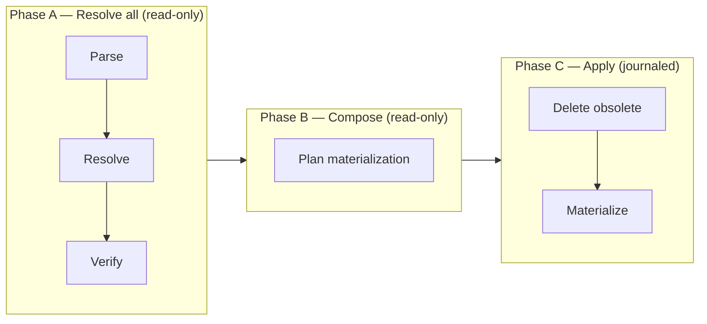
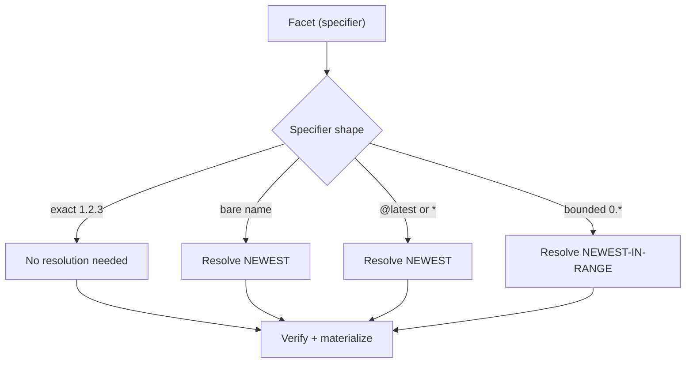
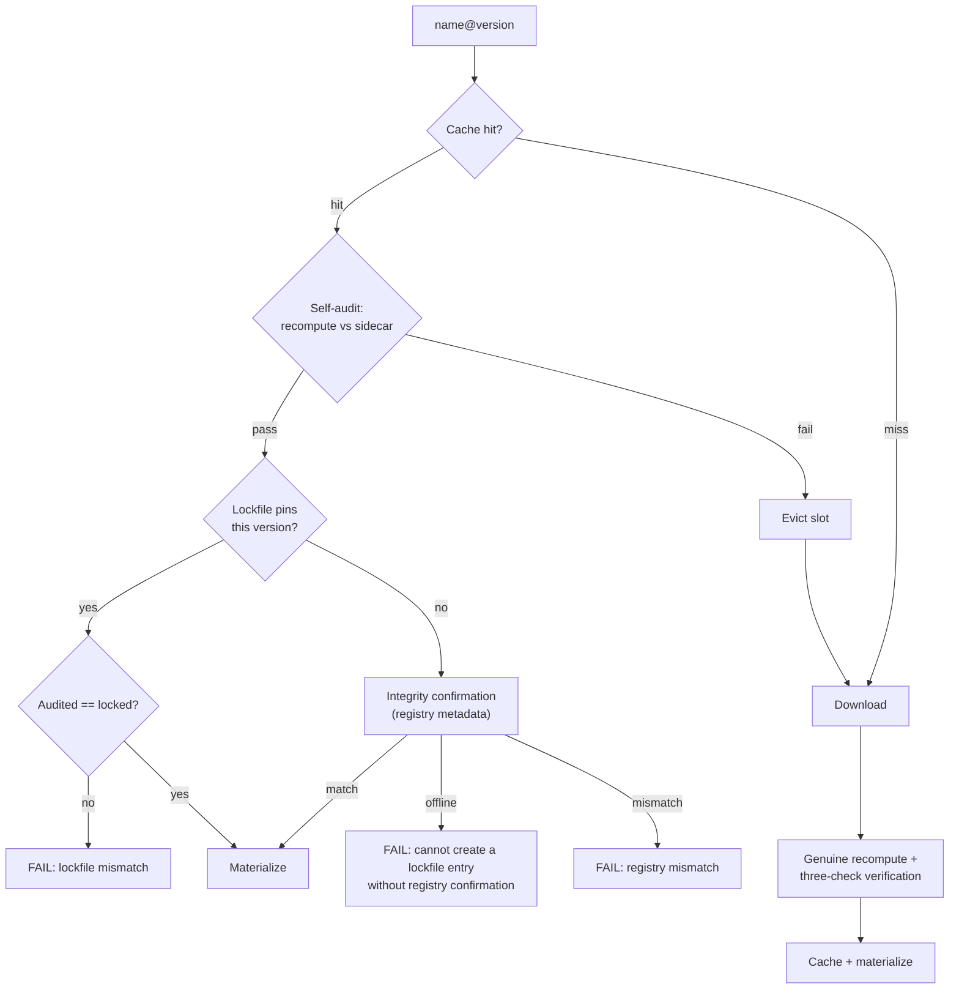
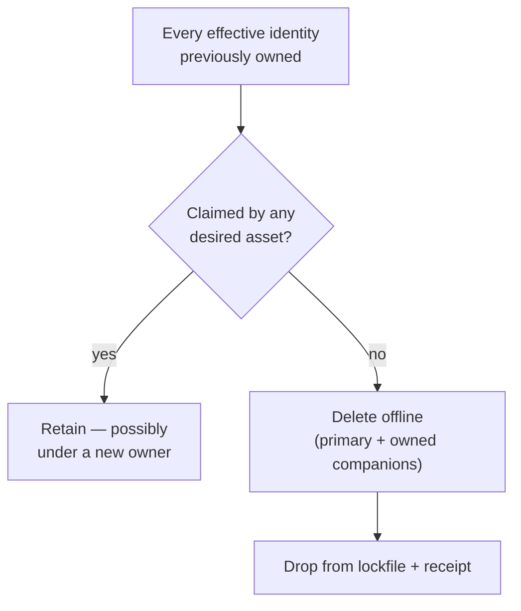
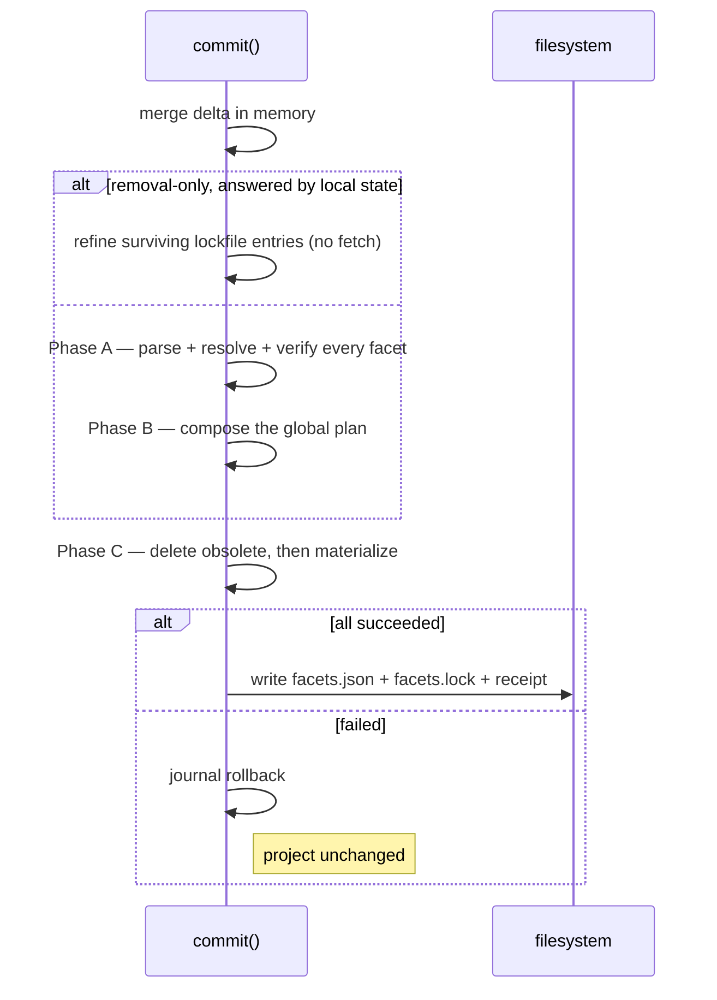

import { DeltaTip, InstallReceiptTip, CanonicalFingerprintTip, SidecarTip } from "/snippets/glossary.jsx";

Commit is phase 2 of the [install pipeline](/specification/install): a single transaction that applies the <DeltaTip>delta</DeltaTip> from [Planning](/specification/planning). Its inputs are the on-disk `facets.json` — including the [materialization](/specification/materialization) intent it records — `facets.lock`, the <InstallReceiptTip>install receipt</InstallReceiptTip>, and the delta.

It is never partial. Commit runs in three phases, and the boundary between the second and third is where mutation begins: everything up to and including [Compose](#compose) is read-only, so a failure there leaves the project byte-identical without needing to undo anything. A [removal-only short circuit](#removal-only-short-circuit) skips both read-only phases when local state already answers for every surviving facet; it writes nothing until that same boundary. From the first write onward, every write records its inverse in the **journal**, and a failure MUST replay it in reverse to leave the project exactly as it was.

<CardGroup cols={3}>
  <Card title="Verify" icon="shield-check">
    Cache self-audit, lockfile comparison, or registry confirmation. Tampered content never materializes.
  </Card>
  <Card title="Materialize" icon="download">
    Assets written to every selected adapter, journaled for rollback.
  </Card>
  <Card title="Commit" icon="check">
    `facets.json` + `facets.lock` + receipt written together, atomically.
  </Card>
</CardGroup>

## Sequence

<Steps>
  <Step title="Load state and gate">
    The manifest is read and the **install lock** — a per-project advisory lock ensuring only one install operates on a project at a time — is acquired. A frozen operation carrying a non-empty delta is rejected here, before the lockfile is even read, so `facet add --frozen-lockfile` against a corrupt lockfile reports the operation it cannot perform rather than a file it never needed to open.

    The lockfile and receipt are then loaded (an invalid receipt is re-bootstrapped from the lockfile; receipt asset entries with crafted names are reported and skipped individually). A delta naming the same facet in both additions and removals MUST be rejected, and the adapters selected for this operation MUST pass the adapter API compatibility preflight — a defense-in-depth re-check behind the command-level gate that already rejected any incompatible installed adapter before planning. Every incompatible adapter is collected, not just the first. A selected adapter whose declared adapter API the CLI does not support MUST fail the commit here, before any Git or local facet build can invoke adapter metadata methods. Failures here touch nothing — no rollback is needed.
  </Step>
  <Step title="Merge delta in memory">
    Additions are upserted, removals are deleted — all in memory. The on-disk `facets.json` MUST NOT be written ahead of the install. Re-adding a facet preserves any materialization overrides already recorded for it: changing where a facet comes from is not a statement about how its assets should be named.

    The frozen gates then run against the merged result (see [Frozen lockfile](#frozen-lockfile)).
  </Step>
  <Step title="Phase A — Resolve all">
    Every facet in the **desired set** — the manifest's facets after the delta is merged in memory — is [parsed, resolved, and verified](#the-three-phases), in a deterministic order. Nothing is written. The phase stops at the first failure. Skipped entirely by the [removal-only short circuit](#removal-only-short-circuit).
  </Step>
  <Step title="Phase B — Compose">
    The complete set of verified contributions, plus the project's recorded intent, becomes either one collision-free plan or the complete list of [collisions](#compose) blocking it. Still nothing written.
  </Step>
  <Step title="Phase C — Apply">
    The journal opens. Obsolete assets are deleted in one global pass, then every desired asset is [materialized](#materialize) under its effective name. Deleting first is what lets a name move between facets safely.
  </Step>
  <Step title="Transactional tri-write">
    The [manifest-write policy](#manifest-write-policy) is applied just before the write, then `facets.json`, `facets.lock`, and the receipt are written together. A failure anywhere rolls back all materialization and leaves all three files unchanged.
  </Step>
</Steps>

## Removal-only short circuit

Removing a facet asks only about state this machine already has. So a non-frozen operation whose delta contains only removals skips Phases A and B whenever local state still answers for every **survivor** — every facet that is staying.

Six conditions MUST all hold:

- every survivor has a lockfile entry;
- each of those entries still matches its manifest source and specifier;
- the surviving locked asset set plans cleanly (no recorded collision, no invalid alias);
- the manifest declares no materialization intent the lockfile does not already record;
- no effective identity a survivor keeps was also claimed by a facet being removed;
- this machine's [install receipt](#machine-local-install-receipt), when present, is readable and witnesses every survivor it records — same version, same materialized assets, same dispositions, same owned files.

When they do, commit refines the surviving entries **structurally** instead of resolving them: source, version, integrity, per-file records, and unrecognized fields are carried forward unchanged, and each asset's recorded disposition is attached (an entry written before dispositions existed refines to `authored`). Nothing is fetched, rebuilt, or re-verified — which is what lets `facet remove` work with a cold cache and an unreachable registry even when an unrelated survivor is unavailable. Refinement is lossless, so it applies to every readable lockfile version and still writes the current one.

When any condition fails, the ordinary phases run. Those cases genuinely need resolution, and failing instead would break removals that work today for reasons unrelated to what is being removed.

The last two conditions are about the gap between shared state and this machine. A `git pull` can change what the lockfile says an asset is called without touching the file on disk, and a lockfile written before cross-facet collisions were detected can record two facets claiming one name. In both cases the survivor's bytes are not where the lockfile says they are — and this path writes nothing, so only ordinary resolution can put them there. A survivor absent from a readable receipt, or a project with no receipt, is a bootstrap gap; a corrupt or path-mismatched receipt is not, because projecting it from the lockfile would make the lockfile witness itself.

<Note>
The short circuit changes how the surviving entries are produced, not what is written. Drift removal, the journal, and the [transactional tri-write](#transactional-tri-write) are identical on both paths. The receipt it commits is the record it just witnessed, never a projection of the lockfile — an operation that materializes nothing must not claim an identity it did not write. Cancellation is honored at the same two checkpoints as the ordinary path: before anything is deleted (nothing is written) and after deletion but before the tri-write (the deletes are rolled back).
</Note>

## Registry interactions

Commit makes three distinct kinds of registry interaction, gated independently. The wire protocol behind them — endpoints, request and response shapes — is owned by the registry's own API specification and is out of scope for this document.

**Version resolution** determines the exact version a specifier refers to (turning `0.*`, `*`, `latest`, or a bare name into a concrete `X.Y.Z`). Needed **only when no exact version is already known** — an exact specifier needs none; a satisfying lockfile entry needs none. When it does fire, the metadata response also carries the published fingerprint, so integrity confirmation rides version resolution for free.

**Archive resolution** downloads the archive bytes for an exact `name@version`. Needed **only on a cache miss** — a warm cache skips it entirely, regardless of how the exact version was obtained.

**Integrity confirmation** verifies the cached or downloaded content against the registry's published <CanonicalFingerprintTip>canonical fingerprint</CanonicalFingerprintTip> (`content_integrity`). Needed **only when a lockfile entry is being created or replaced** — a satisfying lockfile entry serves as the trust anchor instead. An unreachable registry MUST fail the operation rather than write an unconfirmed entry.

These combine independently: a facet may need any combination, or none. The cache short-circuits archive resolution; a satisfying lockfile entry short-circuits integrity confirmation.

<Info>
Registry versions are immutable — the bytes for a published `name@version` never change. Integrity confirmation and lockfile comparison enforce this invariant **client-side** rather than assuming it.
</Info>

## The three phases

When commit resolves, it is **not** an interleaved per-facet loop. Every facet is fully resolved and verified before any facet is materialized, because cross-facet collision detection needs the complete desired asset set to exist before the first adapter write — which is impossible while facet N is materialized before facet N+1 is fetched.

Facets are processed in a deterministic order — sorted by name, not manifest key order — because which facet fails first is user-visible.

### Parse

The manifest is a `name → value` map, and each value is re-parsed per facet. For a registry entry the value is a bare version specifier (`1.2.3`, `1.*`, `1.2.*`, `*`, `latest`) and the facet name lives in the key, so the full source is reconstructed as `name@specifier`. For git and local entries the value is a self-contained source string (URL, `file:` path) and the key is just a label.

### Resolve

Whether the lockfile is trusted for version resolution depends on **how an entry is requested**, not on a flag:

**Implicit version request** — the lockfile is **NOT trusted** for version resolution. A non-exact specifier during an `add` (`foo-facet`, `foo-facet@1.*`, `foo-facet@latest`) always triggers resolution to the newest matching version, **even when the lockfile already satisfies it**. The user explicitly asked for this version or range — the request is honored.

**Explicit version request** — the lockfile **IS trusted** when satisfying a version (`foo-facet@2.0.1`). A satisfying recorded version needs no version resolution; only an absent or stale entry triggers it. The facet was already declared — the locked state is reproduced.

The **exact-version gate** then decides whether the network fires at all: a satisfying lockfile entry supplies the exact version (no resolution), an exact specifier supplies it directly, and only a non-exact, unlocked specifier resolves fresh against the registry.

### Verify

Once a fully-qualified version is in hand, the cache and integrity path is identical regardless of how the version was obtained. The hash domains and guarantees behind these checks are defined in the [Integrity Model](/specification/integrity).

<Note>
A cache hit is **never taken at face value**. The self-audit always runs on the hit path, followed by exactly one anchor check: lockfile comparison when the lockfile pins this version, integrity confirmation when it does not. The two anchor checks are mutually exclusive.
</Note>

<Steps>
  <Step title="Cache self-audit">
    Recompute the cached content's hashes (per-entry and canonical archive) against the <SidecarTip>integrity sidecar</SidecarTip> (`cache-integrity.json`) written at populate time. A failure MUST **evict the slot**; the chain is retried exactly once as a download. Tampered content MUST NOT be materialized.
  </Step>
  <Step title="Lockfile comparison">
    When the lockfile pins this version, the audited integrity MUST equal the locked integrity (string comparison). A mismatch MUST fail the commit — the highest-priority check, never a silent re-download.
  </Step>
  <Step title="Integrity confirmation">
    When **no** satisfying lockfile entry exists, the audited integrity MUST equal the registry's published `content_integrity`. An unreachable registry MUST fail the commit: a lockfile entry is never written on trust.
  </Step>
</Steps>

On a miss, the downloaded content's canonical fingerprint MUST be **genuinely recomputed** from the extracted bytes (per-entry hashes plus the canonical-archive hash) — never taken from the build manifest's self-declared claim. The recomputed value MUST be verified against the registry's published `content_integrity` and, when the lockfile pins this version, against the locked integrity, before the verified content populates the cache.

**On reproduction**, install also proves a four-way agreement per file: the recomputed archive-entry hash, the [lockfile](/specification/lockfile) per-file integrity, the verified build-manifest hash, and the complete owned-file set MUST all agree. A mismatch fails the commit with the exact drifting path.

This reconciliation applies only when the facet resolves to the integrity already locked. A legitimate change — a new version, an edited local facet, a removed asset — resolves to a *different* integrity, so there is nothing to reconcile against. It is also skipped for a legacy identity-only lockfile entry, which records no per-file hashes, and in frozen mode, where the drift preflight substitutes for it. Archive-only supplementary files (like `README.md`) are verified as archive entries but are **never written to disk**.

#### Git and local sources

Git and local facets are **built from source** during commit rather than downloaded as archives, and each has its own verification contract:

**Git** — the lockfile pins the resolved **commit SHA** (the ref stays in `facets.json`); a clone that cannot be resolved to a commit MUST fail the install. A locked entry is served cache-first: the slot is self-audited against its sidecar, and an audited hit that contradicts the locked integrity is the same hard failure as the registry path. On a miss, the clone is pinned to the locked commit, built, and held to a **one-check reproduction guard**: the built content MUST hash to the locked integrity, or the install fails — the tag-move defense. Registry-style integrity confirmation does not apply to git sources.

**Local** — trust-by-path: the source is containment-checked, rebuilt from disk on every install, and the lockfile follows what is on disk (no integrity confirmation, no caching). The exception is frozen mode, which promises bit-for-bit reproduction: the built content MUST hash to the locked integrity or the install fails, and the entry is never rewritten.

### Compose

Compose turns the complete set of verified authored contributions, plus the project's persisted intent, into either one collision-free global plan or the complete list of collisions blocking it. **Nothing here writes.**

This is the only place lockfile entries are constructed **from resolved state**. Resolution deliberately produces no disposition, so a provisional `authored` can never masquerade as a real decision. The [removal-only short circuit](#removal-only-short-circuit) also produces entries, but by carrying locked ones forward rather than deriving them from a resolution.

Compose applies the [materialization planner](/specification/materialization#planning-rules) — the same pure rule the CLI uses to recompute status while you edit a collision interactively. Three outcomes are possible:

- **Collision-free** — the plan proceeds to Apply.
- **Invalid alias** — an override's alias does not satisfy the asset-name grammar. No effective set can be derived from it, so no collision report is possible either; the commit fails.
- **Collisions** — two or more assets claim one logical identity. Every group and every claimant is reported, never truncated and never resolved by picking a winner.

When a collision is found, an interactive caller MAY be offered the chance to resolve it. The resolver returns **overrides, not a winner** — exactly the durable intent a user could have written by hand — and its answer is re-planned as defense in depth before being accepted. There is no automatic retry loop: a resolver that returns a still-colliding answer fails the commit rather than being re-invoked. Cancelling is its own outcome, distinguished from a collision report and from a resolver that returned an unusable answer, so a caller never has to infer intent from an error message. It is still an unsuccessful commit and is surfaced as one — but nothing was written, so there is nothing to undo and nothing to inspect.

A frozen or non-interactive commit MUST report rather than resolve. Frozen mode reproduces recorded intent, so it must never collect a new decision — not even from a human sitting at a terminal.

### Materialize

Materialization writes assets from verified content into each selected adapter's storage, under each asset's **effective** name. Every adapter request, journal label, and failure report addresses the file on disk, which is named by the project's disposition — not by the publisher. Content lookup, canonical paths, and integrity stay anchored to the authored name; see [Two identities](/specification/materialization#two-identities). An omitted asset never reaches an adapter at all.

A skill is written as an **atomic bundle**: its `SKILL.md` and every owned companion file are staged, committed, and rolled back as one all-or-nothing adapter operation carrying the validated owned-file set — the adapter never infers ownership from disk. Writes are skip-if-identical **per asset**: the write is skipped only when the primary *and* every companion already match on disk, so a single drifted companion (or a changed companion set) forces a repair through the same atomic bundle replacement. A facet whose lockfile entry is unchanged but whose on-disk files needed rewriting is reported as *repaired* (the full outcome taxonomy is documented at [`facet install`](/cli/install#outcomes)). An interrupted install converges on re-run without deleting unowned files. Every write MUST journal its inverse operation for rollback.

## Lockfile shape

Commit writes `facets.lock` as part of the tri-write: per facet, the tagged source provenance, the exact resolved version, the integrity that was verified when the entry was written (carried forward unchanged by any later rewrite that does not re-resolve the facet), and the contributed assets — each asset carrying its resolved materialization disposition and a per-file `{ path, integrity }` ownership record. Omitted assets are listed too: the lockfile records the resolved asset **set**, not the on-disk set. The full schema is specified in [Lockfile](/specification/lockfile).

## Machine-local install receipt

Receipts are per-project, machine-local records (schema `0.3`) stored outside the project's version-controlled tree ([`$FACET_DIR`](/cli/env)`/receipts/`). They record, for each asset actually present on disk, its authored identity, the authored inner-archive paths it owns, and the disposition it was materialized under — both names are needed to delete an aliased asset offline. Omitted assets never appear.

This lets drift removal clean up correctly — including a skill's owned companions — even when the lockfile no longer mentions the facet, and entirely offline. A legacy primary-only receipt is safely refined rather than rejected, and a receipt written before dispositions existed reads as `authored`. The receipt records ownership, not hashes, and carries its own version axis independent of the lockfile's.

<CardGroup cols={2}>
  <Card title="Per-project isolation" icon="folder">
    Each project has its own receipt, identified by a hash of the project's canonical path. Two projects never share a receipt.
  </Card>
  <Card title="Self-identifying" icon="fingerprint">
    The receipt embeds the canonical path. A mismatch on load MUST fail closed — treated as absent and re-bootstrapped from the lockfile.
  </Card>
  <Card title="Untrusted input" icon="shield">
    Asset entries and per-file ownership paths with crafted names (path traversal, backslashes) are **reported and skipped individually** — each owned path is containment-validated before use, and the rest of the receipt still loads and is processed.
  </Card>
  <Card title="Contained deletion" icon="box">
    Deletion goes through adapters using validated **asset tuples** — `(scope, type, effective name)` triples, the addressable identity of a materialized asset — never raw filesystem paths taken from the receipt. For a skill, the delete request also carries the validated owned-companion path set, so only owned files are removed, unowned files survive, and emptied directories are pruned.
  </Card>
</CardGroup>

## Drift removal

Drift removal is a **single global pass keyed by effective identity**, and it runs at the start of Apply — *before* any asset is written, not after.

The receipt supplies the previous ownership set, with the lockfile as a fallback for facets the receipt does not mention. Every historical claim on one effective identity is unioned, and each claim's owned companion paths are stripped using its **own** authored name, because an aliased skill's recorded paths are authored while its bundle lives under the effective name. The desired set is the composed plan's effective identities. The difference is deleted.

The question asked is *"is this effective identity still claimed by any desired asset?"* — not *"is this facet still wanted?"* An identity is retained even when the facet that used to own it is gone, which is what makes **ownership transfer** work: facet A gives up the name `deploy`, facet B claims it, and B's file survives. A per-facet decision would have deleted it.

Deleting before writing is load-bearing for the same reason. If writes came first, transferring a name would write B's asset and then delete it as part of cleaning up A.

The comparison runs against the **receipt**, not the on-disk lockfile; this is what makes **orphan-on-pull** recoverable (a facet whose lockfile entry vanished because a teammate removed it and you pulled — the receipt still remembers the local materialization). Lockfile entries missing from a freshly-bootstrapped receipt are caught too. And because the asset tuples and owned-file sets to delete come from the receipt itself, removal needs no cache and no network.

Deletions MUST be journaled like every other write — if the commit fails afterward, rollback restores them.

## Manifest-write policy

The manifest value written for an addition depends on the specifier shape. The policy is applied in memory just before the tri-write — never earlier:

| Specifier                                | Manifest value                     | Lockfile value             |
|------------------------------------------|------------------------------------|----------------------------|
| Bare name (no version)                   | Pinned to resolved exact (`1.2.3`) | Resolved exact + integrity |
| Explicit (`1.2.3`, `0.*`, `0.1.*`, `*`, `latest`) | Written verbatim                   | Resolved exact + integrity |
| Reproduction (not an addition)           | Unchanged                          | Unchanged or re-resolved   |

## Transactional tri-write

On success, three files MUST be written together: the project manifest, the lockfile, and the receipt. A failure anywhere MUST leave all three exactly as they were.

<Note>
A failed operation leaves the project exactly as it was — no snapshot/restore needed.
</Note>

## Frozen lockfile

{/* this bucks the <code> wrapping because the `--` gets smushed into a — in mintlify */}
Frozen mode (the [`--frozen-lockfile`](/cli/install#param-frozen-lockfile) flag) treats the lockfile as the complete, authoritative source of truth.

<Warning>
A frozen commit with a non-empty delta (any addition or removal) MUST be rejected immediately. Only a plain `facet install` can run frozen.
</Warning>

Five gates run before anything is touched, and all of them run **before any network access** — a frozen install can refuse without fetching a byte:

<Steps>
  <Step title="Coverage">
    Every manifest facet MUST have a satisfying lockfile entry, the lockfile MUST NOT pin anything the manifest dropped, and git/local sources MUST match their locked provenance.
  </Step>
  <Step title="Format capability">
    A `0.2` lockfile has no field in which to record a disposition. If the manifest declares any materialization override against one, the install MUST fail rather than silently ignore the intent. The fix is one non-frozen install to migrate the lockfile.
  </Step>
  <Step title="Materialization plan over the locked set">
    The [planner](/specification/materialization#planning-rules) runs against the lockfile's recorded assets, so a collision or invalid alias in recorded state is reported before anything is downloaded. Frozen mode never prompts to resolve it.
  </Step>
  <Step title="Stale intent">
    An override naming an asset the locked version does not contain is blocking drift. A normal install prunes it inside the transaction; frozen mode has no transaction to prune in.
  </Step>
  <Step title="Intent vs. recorded disposition">
    For every locked asset, what `facets.json` asks for MUST equal what `facets.lock` records. Editing an alias without re-running a normal install is drift, exactly like editing a version.
  </Step>
</Steps>

| Behavior                         | Frozen mode                                          |
|----------------------------------|------------------------------------------------------|
| Additions or removals            | Rejected                                             |
| Version resolution               | Forbidden — absent/stale entry fails immediately     |
| Integrity confirmation           | Never fires (no entry creation)                      |
| Archive resolution               | Allowed (downloading locked content is reproduction) |
| Bidirectional consistency        | Required (manifest ↔ lockfile)                       |
| Integrity before materialization | Required for every facet (including local sources)   |
| Collision resolution             | Never prompted — reported                            |
| Materialization drift            | Rejected (manifest intent ↔ locked disposition)      |
| Stale overrides                  | Rejected, not pruned                                 |
| Drift removal                    | Runs; receipt is rewritten                           |
| Lockfile write                   | Never                                                |
| Manifest write                   | Never                                                |

## Not in the install flow

- **Text asset resolution** — text is in the archive. No install-time fetching.
- **Disk layout** — determined by adapters, not the specification.
- **Server installation** — `servers` declared by a facet SHOULD be surfaced as a warning; nothing is installed for them.
