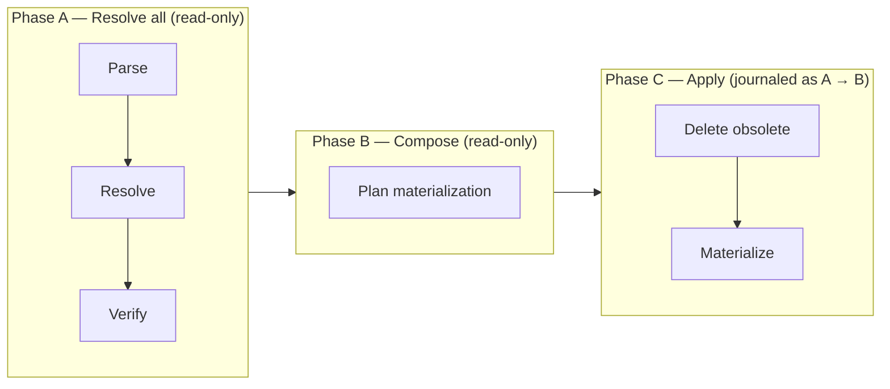
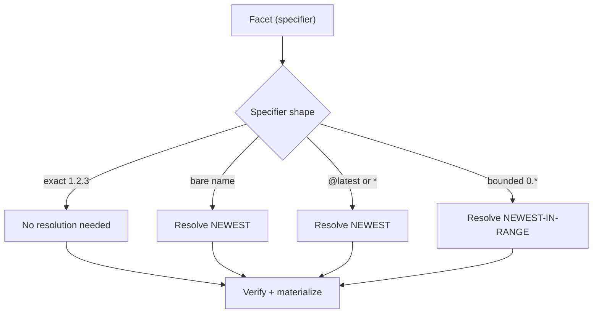
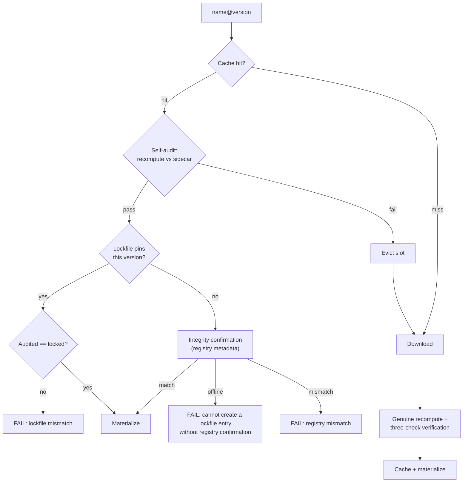
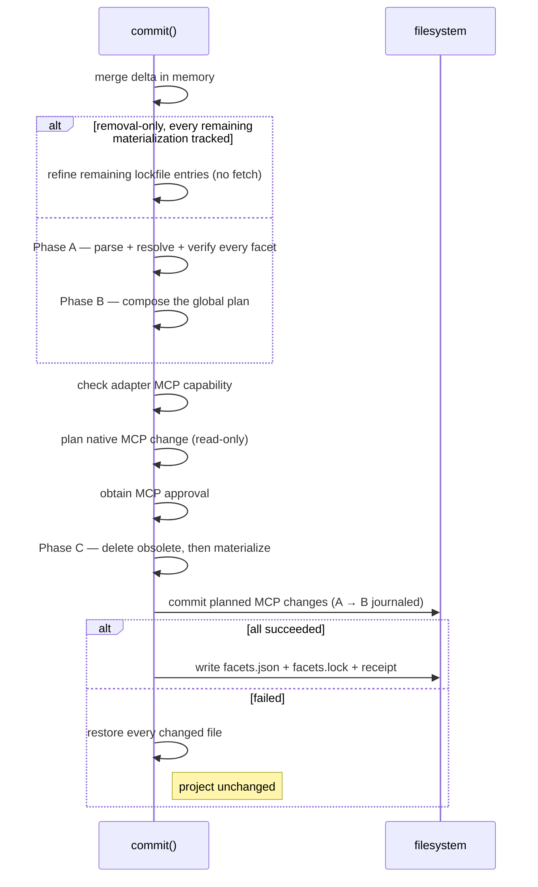

import { DeltaTip, InstallReceiptTip, CanonicalFingerprintTip, SidecarTip } from "/snippets/glossary.jsx";

Commit is phase 2 of the [install pipeline](/specification/install): a single transaction that applies the <DeltaTip>delta</DeltaTip> from [Planning](/specification/planning). Its inputs are the on-disk `facets.json` — including the [materialization](/specification/materialization) intent it records — `facets.lock`, the <InstallReceiptTip>install receipt</InstallReceiptTip>, and the delta.

It is never partial. Commit runs in three phases, and the boundary between the second and third is where mutation begins: everything up to and including [MCP consent](#mcp-configuration) — resolution, composition, adapter capability checks, and read-only native-configuration preparation — is read-only, so a failure or a declined approval there leaves the project byte-identical without needing to undo anything. A [removal-only short circuit](#removal-only-short-circuit) skips both read-only phases when this machine's receipt already answers for every remaining facet; it writes nothing until that same boundary. From the first write onward, every change is recorded in the **transition journal** as an exact `before → after` pair, and a failure MUST use it to put every file back byte for byte.

<CardGroup cols={3}>
  <Card title="Verify" icon="shield-check">
    Cache self-audit, lockfile comparison, or registry confirmation. Tampered content never materializes.
  </Card>
  <Card title="Materialize" icon="download">
    Assets written to every selected adapter, then approved MCP configuration reconciled — every change journaled with both its endpoints.
  </Card>
  <Card title="Commit" icon="check">
    `facets.json` + `facets.lock` + receipt written together, atomically.
  </Card>
</CardGroup>

## Sequence

<Steps>
  <Step title="Load state and gate">
    The manifest is read and the **install lock** — a per-project advisory lock ensuring only one install operates on a project at a time — is acquired. A frozen operation carrying a non-empty delta is rejected here, before the lockfile is even read, so `facet add --frozen-lockfile` against a corrupt lockfile reports the operation it cannot perform rather than a file it never needed to open.

    The lockfile and receipt are then loaded (a receipt that is absent, corrupt, or path-mismatched witnesses nothing and is never projected from the lockfile; the two readable failures are reported; individual receipt asset entries that fail validation are reported and skipped, leaving the files they covered in place). A delta naming the same facet in both additions and removals MUST be rejected, and the adapters selected for this operation MUST pass the adapter API compatibility preflight — a defense-in-depth re-check behind the command-level gate that already rejected any incompatible installed adapter before planning. Every incompatible adapter is collected, not just the first. A selected adapter whose declared adapter API the CLI does not support MUST fail the commit here, before any Git or local facet build can invoke adapter metadata methods. Failures here touch nothing — no rollback is needed.
  </Step>
  <Step title="Merge delta in memory">
    Additions are upserted, removals are deleted — all in memory. The on-disk `facets.json` MUST NOT be written ahead of the install. Re-adding a facet preserves any materialization overrides already recorded for it: changing where a facet comes from is not a statement about how its assets should be named.

    The frozen gates then run against the merged result (see [Frozen lockfile](#frozen-lockfile)).
  </Step>
  <Step title="Phase A — Resolve all">
    Every facet in the **desired set** — the manifest's facets after the delta is merged in memory — is [parsed, resolved, and verified](#the-three-phases), in a deterministic order. Nothing is written. The phase stops at the first failure. Skipped entirely by the [removal-only short circuit](#removal-only-short-circuit).
  </Step>
  <Step title="Phase B — Compose">
    The complete set of verified contributions, plus the project's recorded intent, becomes either one collision-free plan or the complete list of [collisions](#compose) blocking it — across both assets and MCP servers. Still nothing written.
  </Step>
  <Step title="Adapter capability check">
    If the composed plan contains any active MCP declaration, every selected adapter MUST be able to configure MCP servers. Adapters that cannot are collected into **one** failure naming all of them, raised before any approval is requested and before any mutation. See [MCP configuration](#mcp-configuration).
  </Step>
  <Step title="Plan native configuration">
    Each supporting adapter parses its own native project document and computes its complete MCP change **read-only**, reporting per-server outcomes and the exact transitions for the documents it actually changes. A parse or native planning conflict fails here, still with nothing written. This is also where an untracked entry already occupying a desired server name is discovered — at no extra I/O cost, because the document has just been parsed.
  </Step>
  <Step title="MCP approval">
    Every new or changed declaration, plus every untracked native entry that would be adopted or replaced, is presented as one request. Approval covers the complete set; declining ends the operation with nothing to undo, because nothing has been written. See [MCP configuration](#mcp-configuration).
  </Step>
  <Step title="Phase C — Apply">
    The first write happens here. Obsolete assets are deleted in one global pass, then every desired asset is [materialized](#materialize) under its effective name. Deleting first is what lets a name move between facets safely. An occupied destination the receipt does not own triggers a [just-in-time takeover gate](#untracked-destinations) here.
  </Step>
  <Step title="Commit native MCP configuration">
    Each planned change is committed as one batch, **after** all asset writes and immediately before the tri-write — the narrowest window in which a tool watching its own config could observe a server that a later failure would undo. Each document's planned state is re-checked immediately before it is written, and both endpoints of every write enter the journal.
  </Step>
  <Step title="Transactional tri-write">
    The [manifest-write policy](#manifest-write-policy) is applied just before the write, then `facets.json`, `facets.lock`, and the receipt are written together. A failure anywhere rolls back all materialization and all native configuration, and leaves all three files unchanged.
  </Step>
</Steps>

## Removal-only short circuit

Removing a facet asks only about state this machine already has. So a non-frozen operation whose delta contains only removals skips Phases A and B whenever local state still answers for every **remaining facet** — every facet that is staying.

A lockfile must exist, and six conditions MUST all hold:

- every remaining facet has a lockfile entry;
- each of those entries still matches its manifest source and specifier;
- the remaining locked asset set plans cleanly (no recorded collision, no invalid alias);
- the manifest declares no materialization intent the lockfile does not already record;
- no effective identity a remaining facet keeps was also claimed by a facet being removed;
- every remaining materialization is **tracked**: this machine's [install receipt](#machine-local-install-receipt) loaded, records each remaining facet, and agrees with the lockfile about version, materialized assets, dispositions, and owned files.

Configuration claims are carried forward on this path only when the receipt proves each remaining claim is still anchored to the same facet integrity the lockfile records. A receipt written before configuration claims existed proves nothing about them, so it forces ordinary resolution rather than a guess — the CLI will not invent ownership of a server entry it cannot show it wrote.

When they do, commit refines the remaining entries **structurally** instead of resolving them: source, version, integrity, per-file records, and unrecognized fields are carried forward unchanged, and each asset's recorded disposition is attached (an entry written before dispositions existed refines to `authored`). Nothing is fetched, rebuilt, or re-verified — which is what lets `facet remove` work with a cold cache and an unreachable registry even when an unrelated remaining facet is unavailable. Refinement is lossless, so it applies to every readable lockfile version and still writes the current one.

When any condition fails, the ordinary phases run. Those cases genuinely need resolution, and failing instead would break removals that work today for reasons unrelated to what is being removed.

The last two conditions are about the gap between shared state and this machine. A `git pull` can change what the lockfile says an asset is called without touching the file on disk, and a lockfile written before cross-facet collisions were detected can record two facets claiming one name. In both cases the remaining bytes are not where the lockfile says they are — and this path writes nothing, so only ordinary resolution can put them there. The same applies when the receipt says nothing at all: an absent, corrupt, or path-mismatched receipt, or one that simply does not record a remaining facet, leaves that materialization **untracked**, and the lockfile cannot stand in for it without making shared state witness itself. The offline short circuit is therefore a property of fully tracked state, not of removal.

<Note>
The short circuit changes how the remaining entries are produced, not what is written. Drift removal, the journal, and the [transactional tri-write](#transactional-tri-write) are identical on both paths. The receipt it commits is the record it just witnessed, never a projection of the lockfile — an operation that materializes nothing must not claim an identity it did not write. Cancellation is honored at the same two checkpoints as the ordinary path: before anything is deleted (nothing is written) and after deletion but before the tri-write (the deletes are rolled back).
</Note>

## Registry interactions

Commit makes three distinct kinds of registry interaction, gated independently. The wire protocol behind them — endpoints, request and response shapes — is owned by the registry's own API specification and is out of scope for this document.

**Version resolution** determines the exact version a specifier refers to (turning `0.*`, `*`, `latest`, or a bare name into a concrete `X.Y.Z`). Needed **only when no exact version is already known** — an exact specifier needs none; a satisfying lockfile entry needs none. When it does fire, the metadata response also carries the published fingerprint, so integrity confirmation rides version resolution for free.

**Archive resolution** downloads the archive bytes for an exact `name@version`. Needed **only on a cache miss** — a warm cache skips it entirely, regardless of how the exact version was obtained.

**Integrity confirmation** verifies the cached or downloaded content against the registry's published <CanonicalFingerprintTip>canonical fingerprint</CanonicalFingerprintTip> (`content_integrity`). Needed **only when a lockfile entry is being created or replaced** — a satisfying lockfile entry serves as the trust anchor instead. An unreachable registry MUST fail the operation rather than write an unconfirmed entry.

These combine independently: a facet may need any combination, or none. The cache short-circuits archive resolution; a satisfying lockfile entry short-circuits integrity confirmation.

<Info>
Registry versions are immutable — the bytes for a published `name@version` never change. Integrity confirmation and lockfile comparison enforce this invariant **client-side** rather than assuming it.
</Info>

## The three phases

When commit resolves, it is **not** an interleaved per-facet loop. Every facet is fully resolved and verified before any facet is materialized, because cross-facet collision detection needs the complete desired asset set to exist before the first adapter write — which is impossible while facet N is materialized before facet N+1 is fetched.

Facets are processed in a deterministic order — sorted by name, not manifest key order — because which facet fails first is user-visible.

### Parse

The manifest is a `name → value` map, and each value is re-parsed per facet. For a registry entry the value is a bare version specifier (`1.2.3`, `1.*`, `1.2.*`, `*`, `latest`) and the facet name lives in the key, so the full source is reconstructed as `name@specifier`. For git and local entries the value is a self-contained source string (URL, `file:` path) and the key is just a label.

### Resolve

Whether the lockfile is trusted for version resolution depends on **how an entry is requested**, not on a flag:

**Implicit version request** — the lockfile is **NOT trusted** for version resolution. A non-exact specifier during an `add` (`foo-facet`, `foo-facet@1.*`, `foo-facet@latest`) always triggers resolution to the newest matching version, **even when the lockfile already satisfies it**. The user explicitly asked for this version or range — the request is honored.

**Explicit version request** — the lockfile **IS trusted** when satisfying a version (`foo-facet@2.0.1`). A satisfying recorded version needs no version resolution; only an absent or stale entry triggers it. The facet was already declared — the locked state is reproduced.

The **exact-version gate** then decides whether the network fires at all: a satisfying lockfile entry supplies the exact version (no resolution), an exact specifier supplies it directly, and only a non-exact, unlocked specifier resolves fresh against the registry.

### Verify

Once a fully-qualified version is in hand, the cache and integrity path is identical regardless of how the version was obtained. The hash domains and guarantees behind these checks are defined in the [Integrity Model](/specification/integrity).

<Note>
A cache hit is **never taken at face value**. The self-audit always runs on the hit path, followed by exactly one anchor check: lockfile comparison when the lockfile pins this version, integrity confirmation when it does not. The two anchor checks are mutually exclusive.
</Note>

<Steps>
  <Step title="Cache self-audit">
    Recompute the cached content's hashes (per-entry and canonical archive) against the <SidecarTip>integrity sidecar</SidecarTip> (`cache-integrity.json`) written at populate time. A failure MUST **evict the slot**; the chain is retried exactly once as a download. Tampered content MUST NOT be materialized.
  </Step>
  <Step title="Lockfile comparison">
    When the lockfile pins this version, the audited integrity MUST equal the locked integrity (string comparison). A mismatch MUST fail the commit — the highest-priority check, never a silent re-download.
  </Step>
  <Step title="Integrity confirmation">
    When **no** satisfying lockfile entry exists, the audited integrity MUST equal the registry's published `content_integrity`. An unreachable registry MUST fail the commit: a lockfile entry is never written on trust.
  </Step>
</Steps>

On a miss, the downloaded content's canonical fingerprint MUST be **genuinely recomputed** from the extracted bytes (per-entry hashes plus the canonical-archive hash) — never taken from the build manifest's self-declared claim. The recomputed value MUST be verified against the registry's published `content_integrity` and, when the lockfile pins this version, against the locked integrity, before the verified content populates the cache.

**On reproduction**, install also proves a four-way agreement per file: the recomputed archive-entry hash, the [lockfile](/specification/lockfile) per-file integrity, the verified build-manifest hash, and the complete owned-file set MUST all agree. A mismatch fails the commit with the exact drifting path.

This reconciliation applies only when the facet resolves to the integrity already locked. A legitimate change — a new version, an edited local facet, a removed asset — resolves to a *different* integrity, so there is nothing to reconcile against. It is also skipped for a legacy identity-only lockfile entry, which records no per-file hashes, and in frozen mode, where the drift preflight substitutes for it. Archive-only supplementary files (like `README.md`) are verified as archive entries but are **never written to disk**.

#### Git and local sources

Git and local facets are **built from source** during commit rather than downloaded as archives, and each has its own verification contract:

**Git** — the lockfile pins the resolved **commit SHA** (the ref stays in `facets.json`); a clone that cannot be resolved to a commit MUST fail the install. A locked entry is served cache-first: the slot is self-audited against its sidecar, and an audited hit that contradicts the locked integrity is the same hard failure as the registry path. On a miss, the clone is pinned to the locked commit, built, and held to a **one-check reproduction guard**: the built content MUST hash to the locked integrity, or the install fails — the tag-move defense. Registry-style integrity confirmation does not apply to git sources.

**Local** — trust-by-path: the source is containment-checked, rebuilt from disk on every install, and the lockfile follows what is on disk (no integrity confirmation, no caching). The exception is frozen mode, which promises bit-for-bit reproduction: the built content MUST hash to the locked integrity or the install fails, and the entry is never rewritten.

### Compose

Compose turns the complete set of verified authored contributions, plus the project's persisted intent, into either one collision-free global plan or the complete list of collisions blocking it. **Nothing here writes.**

This is the only place lockfile entries are constructed **from resolved state**. Resolution deliberately produces no disposition, so a provisional `authored` can never masquerade as a real decision. The [removal-only short circuit](#removal-only-short-circuit) also produces entries, but by carrying locked ones forward rather than deriving them from a resolution.

Compose applies the [materialization planner](/specification/materialization#planning-rules) — the same pure rule the CLI uses to recompute status while you edit a collision interactively. Three outcomes are possible:

- **Collision-free** — the plan proceeds to the adapter capability check.
- **Invalid alias** — an override's alias does not satisfy the asset-name grammar. No effective set can be derived from it, so no collision report is possible either; the commit fails.
- **Collisions** — two or more contributions claim one logical identity. Every group and every claimant is reported, never truncated and never resolved by picking a winner.

Assets and MCP servers compose in the same pass but in separate identity spaces. Server claims are grouped by effective server name after aliases and omissions are applied; claims whose [canonical declaration fingerprints](#machine-local-install-receipt) match compose into one configuration retaining every claimant, while differing fingerprints form a collision group. See [Server collisions](/specification/materialization#server-collisions).

When a collision is found, an interactive caller MAY be offered the chance to resolve it. The resolver returns **overrides, not a winner** — exactly the durable intent a user could have written by hand — and its answer is re-planned as defense in depth before being accepted. There is no automatic retry loop: a resolver that returns a still-colliding answer fails the commit rather than being re-invoked. Cancelling is its own outcome, distinguished from a collision report and from a resolver that returned an unusable answer, so a caller never has to infer intent from an error message. It is still an unsuccessful commit and is surfaced as one — but nothing was written, so there is nothing to undo and nothing to inspect.

A frozen or non-interactive commit MUST report rather than resolve. Frozen mode reproduces recorded intent, so it must never collect a new decision — not even from a human sitting at a terminal.

### Materialize

Materialization writes assets from verified content into each selected adapter's storage, under each asset's **effective** name. Every adapter request, journal label, and failure report addresses the file on disk, which is named by the project's disposition — not by the publisher. Content lookup, canonical paths, and integrity stay anchored to the authored name; see [Two identities](/specification/materialization#two-identities). An omitted asset never reaches an adapter at all.

The adapter decides *what* should change and returns exact per-file transitions; the engine performs every write. A skill is planned as an **atomic bundle**: its `SKILL.md`, every owned companion, and the removal of owned companions the new bundle drops are one batch that commits together or not at all — the adapter never infers ownership from disk. A file already holding the bytes the plan would write contributes no change at all, so re-installing an unchanged asset touches no modification time. A single drifted companion still forces a repair, through the same batch. A facet whose lockfile entry is unchanged but whose on-disk files needed rewriting is reported as *repaired* (the full outcome taxonomy is documented at [`facet install`](/cli/install#outcomes)). An interrupted install converges on re-run without deleting unowned files.

### The transition journal

Every change the engine performs is recorded as `A → B`: the exact state the file was in, and the exact state this run produced. Four rules follow from that shape:

- **Only real changes are journaled.** A file read to compute a change — but not changed — never enters the journal, so a concurrent edit to it survives a rollback untouched.
- **The precondition is checked immediately before the write.** If the file no longer holds the state the plan was computed from, the write is refused and reported as a conflict rather than applied over somebody else's change.
- **Rollback compares against `B`, not just `A`.** A file still holding what this run wrote is restored to `A`. A file already back at `A` is left alone, mtime included. A file holding anything else is **preserved and reported** — never overwritten. Rollback continues past every such conflict, so one contested file cannot strand the rest.
- **Repeated changes collapse.** `A → B` then `B → C` is journaled as `A → C`, including when different adapters change the same file, so a rollback returns it to where it stood before the run began.

Directories are tracked separately and cleaned up conservatively: rollback removes only directories this run can prove it created, that are still empty, and are still the directories it made. A directory that existed beforehand always survives, and any remaining file prevents removal. The guarantee covers exact file bytes, file permission bits, and directory existence — not directory permissions or timestamps.

The journal covers **handled failures within one run**. It lives in memory and is deliberately not replayed after a crash: a killed or power-lost process is recovered by re-running the install, whose [per-file integrity reconciliation](#materialize) converges disk, lockfile, and receipt without deleting unowned files. A persisted journal would have to prove what it wrote before it could safely undo anything — which is the evidence a re-run recomputes anyway.

### Untracked destinations

A desired effective identity whose destination is already occupied by something the receipt does not own is an **untracked destination**. Desired state authorizes reconciling it, but not silently — the user is told first. The two kinds of destination are disclosed at different moments, for one reason: cost.

- **MCP entries** are disclosed *before* the first write, during read-only planning. The adapter has already parsed the document to plan its change, so occupancy and equality are known for free. Declining therefore has nothing to roll back.
- **Assets** are disclosed *just in time*, during Apply, from the occupancy the adapter's plan already reports. Searching the whole project for takeovers up front would be an eager scan that buys nothing; cancelling here restores every file the run has already changed.

In both cases: continuing adopts equivalent state **without rewriting it**, and replaces divergent state transactionally. A destination the receipt already owns reconciles with no disclosure at all, and a destination the desired set does not name is never inspected or touched.

<Warning>
The two gates are independent. Approving MCP configuration never approves an asset takeover, and vice versa. They ask different questions about different kinds of state, and one answer must not be spent on the other.
</Warning>

## MCP configuration

Active MCP server declarations are reconciled into every selected adapter's project-scoped native configuration. The engine never edits `.mcp.json`, `opencode.jsonc`, or `.codex/config.toml` itself: each adapter owns its tool's format and translates the portable declaration into native terminology.

### Capability

Configuring MCP servers requires an adapter that declares MCP support. One that does not stays perfectly usable for a project with no active declarations. The moment one exists, every such adapter is collected into a single failure that names all of them — raised before approval and before mutation, so the project is untouched. A newer release will not change that answer, so the resolution is to omit the declarations or deselect the adapter.

### Approval

Approval is **machine-local** and is keyed by `(kind, effective name, declaration fingerprint)`. Before any mutation, every active declaration is compared against the approval evidence in this machine's receipt:

- A declaration whose effective name and fingerprint the receipt already approves does **not** prompt again — including on a plain reproduction, and including when a *second* facet contributes the same declaration at the same name.
- A changed command, argument order, environment value, transport, URL, or effective name is a new value and requires approval again.
- Asset ownership in the same receipt confers **no** MCP approval. They are different kinds of evidence.

An interactive caller receives one MCP-only request containing every unapproved declaration with its claimant facets and its exact command, arguments, and environment assignments — or its exact URL — plus a distinct section for every untracked native entry that would be adopted or replaced. Approval accepts the complete set. A non-interactive caller MUST fail with that same complete list unless approval was supplied ahead of time; frozen mode never prompts but MAY use pre-supplied approval.

Approval reaches the receipt only through a **successful** commit. Declining, failing later, or rolling back writes no approval evidence, so the next attempt asks again.

<Note>
Approval never travels to a teammate. It lives in the machine-local receipt rather than `facets.json`, because version-controlled state must not be able to claim that a different machine consented to executing a command on this one. A colleague who clones fully-approved project state approves it themselves.
</Note>

### Reconciliation

Each adapter's contract is one read-only operation, and that is what makes the transaction safe. **Plan** parses the native document once, preserves unrelated state, detects native conflicts, computes the adapter's own rendering of each desired declaration, classifies every key, and returns those outcomes alongside the exact document changes that would realize them. It writes nothing — not even when the document does not exist yet.

Each planned change carries the document's exact inspected state, so the engine can refuse it if something else edited the file, and can put the original bytes back if a later step fails. A document the adapter inspected but does not change is not part of the plan, and is therefore never journaled, never restored, and never touched.

**Native-rendering equality** — computed by the adapter, which is the only component that knows its tool's schema — decides whether an existing entry is adopted without a write. It is semantic: comments, whitespace, member order, and omitted-versus-empty optional collections do not make entries differ, while any value that changes the launch or connection behavior does. An adapter that cannot *prove* equality MUST classify the entry as divergent and let it be replaced, rather than guess.

Adapters supply **no inverse operation**, and no write. The engine commits each change and journals both its endpoints, so rollback restores comments, formatting, and member order exactly. Rollback fidelity never depends on adapter code being correct a second time, or on a semantic inverse reproducing a document's formatting.

Reconciliation preserves everything outside the project's desired set: unrelated tool settings keep their semantic values, server entries the project neither desires nor owns are left completely untouched, and for an owned entry a native field outside the portable model (a timeout, say) survives where the format permits.

<Info>
Configuring a server never runs it. Materialization does not install the executable, start the process, connect to the URL, check health, collect credentials, or perform OAuth. Whatever authentication the tool requires happens in the tool, after the configuration exists.
</Info>

## Lockfile shape

Commit writes `facets.lock` as part of the tri-write: per facet, the tagged source provenance, the exact resolved version, the integrity that was verified when the entry was written (carried forward unchanged by any later rewrite that does not re-resolve the facet), and the contributed assets — each asset carrying its resolved materialization disposition and a per-file `{ path, integrity }` ownership record. Omitted assets are listed too: the lockfile records the resolved asset **set**, not the on-disk set. The full schema is specified in [Lockfile](/specification/lockfile).

The lockfile records **no** MCP declaration, effective server name, server disposition, or approval evidence, and its version is unchanged by MCP support. A facet's integrity already commits to the exact embedded `facet.json` the declaration lives in, so duplicating it here would add a second copy to keep in sync without adding a guarantee. See [Why MCP did not move the lockfile](/specification/lockfile#why-mcp-did-not-move-the-lockfile).

## Machine-local install receipt

Receipts are per-project, machine-local records (schema `0.4`) stored outside the project's version-controlled tree ([`$FACET_DIR`](/cli/env)`/receipts/`). They record, for each asset actually present on disk, its authored identity, the authored inner-archive paths it owns, and the disposition it was materialized under — both names are needed to delete an aliased asset offline. Omitted assets never appear.

This lets drift removal clean up correctly — including a skill's owned companions — even when the lockfile no longer mentions the facet, and entirely offline. A legacy primary-only receipt is safely refined rather than rejected, and a receipt written before dispositions existed reads as `authored`. The receipt records ownership, not hashes, and carries its own version axis independent of the lockfile's.

### Configuration claims

A current receipt additionally records one **configuration claim** per active, successfully reconciled MCP server declaration, carrying the authored server name, its materialized disposition, a fingerprint of the declaration's canonical semantic form, and the facet integrity that witnessed the claim. Omitted declarations were never materialized and are unrepresentable as claims.

A claim does two jobs at once: it is the keyed authority to delete that server entry offline, and it is this machine's evidence that the effective declaration was previously [approved](#mcp-configuration).

The **canonical declaration fingerprint** hashes the declaration's meaning, not its spelling. It preserves the declaration kind and argument order, sorts environment keys, and treats an omitted `args` or `env` as equal to an empty one — so reordering environment members does not re-prompt, while reordering arguments does. It is independent of both the authored and effective name. Claims never store commands, arguments, URLs, environment names, or environment values: the receipt can answer *"was this approved?"* without ever holding the declaration itself.

A receipt older than `0.4` keeps its asset ownership but confers **no** configuration ownership and **no** approval. The loader represents that distinction explicitly rather than synthesizing an empty claim set, because "this machine approved nothing" and "this machine approved nothing *yet knows it approved nothing*" are different facts. In practice a pre-`0.4` receipt means every declaration needs approval and every existing native entry reads as untracked occupancy.

<CardGroup cols={2}>
  <Card title="Per-project isolation" icon="folder">
    Each project has its own receipt, identified by a hash of the project's canonical path. Two projects never share a receipt.
  </Card>
  <Card title="Self-identifying" icon="fingerprint">
    The receipt embeds the canonical path. A mismatch on load MUST fail closed — the receipt witnesses nothing, and the lockfile is never projected in its place.
  </Card>
  <Card title="Untrusted input" icon="shield">
    Asset entries and per-file ownership paths with crafted names (path traversal, backslashes) are **reported and skipped individually** — each owned path is containment-validated before use, and the rest of the receipt still loads and is processed.
  </Card>
  <Card title="Contained deletion" icon="box">
    Deletion goes through adapters using validated **asset tuples** — `(scope, type, effective name)` triples, the addressable identity of a materialized asset — never raw filesystem paths taken from the receipt. For a skill, the delete request also carries the validated owned-companion path set, so only owned files are removed, unowned files survive, and emptied directories are pruned. An obsolete configuration claim is deleted the same way: the adapter removes the complete server entry at that effective name, never a raw edit to the document.
  </Card>
</CardGroup>

## Drift removal

Drift removal is a **single global pass keyed by effective identity**, and it runs at the start of Apply — *before* any asset is written, not after.

The receipt is the **only** source of the previous ownership set. Every historical claim on one effective identity is unioned, and each claim's owned companion paths are stripped using its **own** authored name, because an aliased skill's recorded paths are authored while its bundle lives under the effective name. The desired set is the composed plan's effective identities. The difference is deleted.

Configuration claims are swept in the same pass and by the same rule: an owned effective server identity no remaining desired or carried-forward claim uses has its complete entry removed from every selected adapter. An **untracked** server key is never deleted merely because a facet, an alias, or a lockfile entry disappeared.

The question asked is *"is this effective identity still claimed by any desired asset?"* — not *"is this facet still wanted?"* An identity is retained even when the facet that used to own it is gone, which is what makes **ownership transfer** work: facet A gives up the name `deploy`, facet B claims it, and B's file survives. A per-facet decision would have deleted it.

Deleting before writing is load-bearing for the same reason. If writes came first, transferring a name would write B's asset and then delete it as part of cleaning up A.

Because the comparison runs against the **receipt** and nothing else, **orphan-on-pull** is recoverable (a facet whose lockfile entry vanished because a teammate removed it and you pulled — the receipt still remembers the local materialization), and the reverse is not a deletion: a lockfile entry the receipt never recorded is **untracked**, and the pass leaves whatever is at that identity alone. The asset tuples and owned-file sets to delete come from the receipt itself, so removal of tracked state needs no cache and no network.

Deletions MUST be journaled like every other write — if the commit fails afterward, rollback restores them.

## Ownership, in one rule each

<CardGroup cols={2}>
  <Card title="Desired state authorizes writes" icon="pen">
    Every desired effective identity is reconciled, even if untracked state already occupies it — after its [takeover gate](#untracked-destinations) permits continuing. Reconciling it is what makes it tracked; the committed receipt records it from then on.
  </Card>
  <Card title="Tracked ownership authorizes deletion" icon="trash">
    Only an identity the receipt records can be deleted. Untracked files and untracked server entries at identities the desired set does not name are never addressed, and a lockfile entry alone is not evidence.
  </Card>
</CardGroup>

One rule, two kinds of state. Assets and MCP configurations differ in where they live and who writes them, but not in who may create or destroy them.

**Reconciled** covers two outcomes, because both establish the same fact. Usually the file is written. When what is already on disk matches the desired content, metadata, and owned companions byte for byte, the write is skipped — rewriting identical bytes would prove nothing a comparison has not already proven — and the identity is recorded as tracked all the same.

Ownership is recorded **per project, not per adapter**. The receipt names `(scope, type, name)`, the same adapter-agnostic shape the lockfile uses, and that one record governs every selected adapter. Connecting an adapter is what delegates management of those identities inside it: a facet's `deploy` skill is this project's `deploy` skill in Claude Code and OpenCode alike, and removing the facet removes it from both. Configuration claims work identically — one claim per project, honored by every selected adapter, with no separate per-adapter evidence.

A receipt that cannot be used at all — absent, unreadable, or self-identifying as a different project — is the same case as an empty one: nothing is tracked, so nothing is deleted, and the run records only what it reconciles. The two readable-failure reasons are reported; a missing receipt is just a first operation and is not. An individual receipt entry that fails validation is reported too, and the files it covered are left in place: a claim the CLI cannot safely act on is not a licence to delete.

Aliasing follows from the two rules rather than needing its own. When both claimants in a collision group are aliased away from the authored name, that name is claimed by nothing in the desired set — so if the receipt tracks it, it is deleted in the same pass, before either alias is written. Each alias then receives its own facet's authored content, and the committed receipt records both aliases and not the vacated name. The same holds for any number of claimants: a name nothing in the desired set retains is vacated. An authored name the receipt does *not* track is left alone instead, like any other untracked file.

## Manifest-write policy

The manifest value written for an addition depends on the specifier shape. The policy is applied in memory just before the tri-write — never earlier:

| Specifier                                | Manifest value                     | Lockfile value             |
|------------------------------------------|------------------------------------|----------------------------|
| Bare name (no version)                   | Pinned to resolved exact (`1.2.3`) | Resolved exact + integrity |
| Explicit (`1.2.3`, `0.*`, `0.1.*`, `*`, `latest`) | Written verbatim                   | Resolved exact + integrity |
| Reproduction (not an addition)           | Unchanged                          | Unchanged or re-resolved   |

## Transactional tri-write

On success, three files MUST be written together: the project manifest, the lockfile, and the receipt. A failure anywhere MUST leave all three exactly as they were — and MUST also restore every materialized asset and every native MCP document the operation touched, replaying configuration byte restores and asset inverses in reverse order.

<Note>
A failed operation leaves the project exactly as it was — no snapshot/restore needed.
</Note>

## Frozen lockfile

{/* this bucks the <code> wrapping because the `--` gets smushed into a — in mintlify */}
Frozen mode (the [`--frozen-lockfile`](/cli/install#param-frozen-lockfile) flag) treats the lockfile as the complete, authoritative source of truth **for what to reproduce**. It is not authority to delete — that stays with the receipt in frozen mode exactly as it does everywhere else.

<Warning>
A frozen commit with a non-empty delta (any addition or removal) MUST be rejected immediately. Only a plain `facet install` can run frozen.
</Warning>

Frozen mode never prompts — for a collision or for MCP approval — but it MAY use approval supplied ahead of time on the command line.

Five gates run before anything is touched, and all of them run **before any network access** — a frozen install can refuse without fetching a byte:

<Steps>
  <Step title="Coverage">
    Every manifest facet MUST have a satisfying lockfile entry, the lockfile MUST NOT pin anything the manifest dropped, and git/local sources MUST match their locked provenance.
  </Step>
  <Step title="Format capability">
    A `0.2` lockfile has no field in which to record an **asset** disposition. If the manifest declares any asset materialization override against one, the install MUST fail rather than silently ignore the intent. The fix is one non-frozen install to migrate the lockfile. A *server* disposition can never trigger this gate, because the lockfile deliberately records no server intent at any version.
  </Step>
  <Step title="Materialization plan over the locked set">
    The [planner](/specification/materialization#planning-rules) runs against the lockfile's recorded assets, so a collision or invalid alias in recorded state is reported before anything is downloaded. Frozen mode never prompts to resolve it.
  </Step>
  <Step title="Stale intent">
    An override naming an asset the locked version does not contain, or a server the integrity-pinned facet does not declare, is blocking drift. A normal install prunes it inside the transaction; frozen mode has no transaction to prune in, and reports without removing the override.
  </Step>
  <Step title="Intent vs. recorded disposition">
    For every locked asset, what `facets.json` asks for MUST equal what `facets.lock` records. Editing an alias without re-running a normal install is drift, exactly like editing a version.
  </Step>
</Steps>

MCP adds its own pre-mutation gates: an unresolved effective-server collision, an unsupported selected adapter, an unparseable native document, an integrity mismatch on a declaration, or an unapproved declaration with no pre-supplied approval all fail before any cleanup or materialization. Only once every frozen check passes may native configuration and the machine-local receipt be reconciled — including removing a receipt-owned server entry the manifest and lockfile no longer desire, which frozen mode does while still leaving both files untouched.

<Note>
Unlike the asset-disposition gates, the MCP checks may need to fetch locked content: declarations are not in the lockfile, so proving what a locked facet declares can require the facet itself. Every check still happens before any mutation. This is the accepted cost of not duplicating declarations into the lockfile.
</Note>

| Behavior                         | Frozen mode                                          |
|----------------------------------|------------------------------------------------------|
| Additions or removals            | Rejected                                             |
| Version resolution               | Forbidden — absent/stale entry fails immediately     |
| Integrity confirmation           | Never fires (no entry creation)                      |
| Archive resolution               | Allowed (downloading locked content is reproduction) |
| Bidirectional consistency        | Required (manifest ↔ lockfile)                       |
| Integrity before materialization | Required for every facet (including local sources)   |
| Collision resolution             | Never prompted — reported                            |
| Materialization drift            | Rejected (manifest intent ↔ locked disposition)      |
| Stale overrides                  | Rejected, not pruned                                 |
| MCP approval                     | Never prompted — pre-supplied approval or failure    |
| Unsupported MCP adapter          | Rejected before mutation                             |
| MCP reconciliation               | Allowed once every frozen check passes               |
| Drift removal                    | Runs; receipt is rewritten                           |
| Lockfile write                   | Never                                                |
| Manifest write                   | Never                                                |

A receipt write is the one thing frozen mode does commit, and the one it can survive losing. If it fails, the install still succeeds — the locked set it reproduced is on disk and correct — but the assets it just wrote are untracked, so a later removal will leave them behind. The CLI says so rather than reporting a clean success.

## Not in the install flow

- **Text asset resolution** — text is in the archive. No install-time fetching.
- **Disk layout** — determined by adapters, not the specification.
- **Server acquisition** — a declaration is connection information, not a package reference. Install never downloads, installs, versions, or resolves the software behind a declared server.
- **Server lifecycle** — install writes configuration and stops there. It never launches a command, opens a connection, checks health, collects credentials, or performs OAuth. Facets runs no MCP client, host, proxy, or supervisor.
