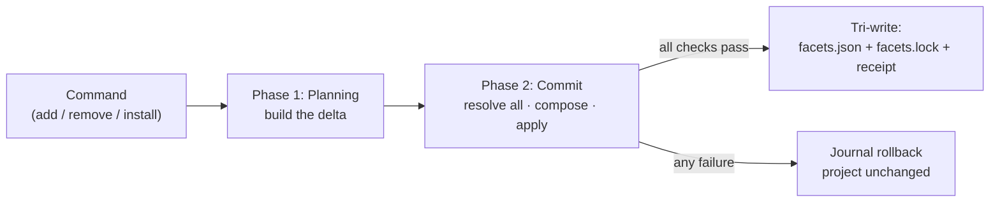

import { DeltaTip } from "/snippets/glossary.jsx";

Installation is a single pipeline with two phases. **[Planning](/specification/planning)** builds a <DeltaTip>delta</DeltaTip> — what should change. **[Commit](/specification/commit)** applies it — resolving versions, verifying [integrity](/specification/integrity), composing one global [materialization](/specification/materialization) plan, writing assets, and writing `facets.json`, `facets.lock`, and the install receipt together. A removal that local state already answers for [skips resolution entirely](/specification/commit#removal-only-short-circuit).

[`facet add`](/cli/add), [`facet remove`](/cli/remove), and [`facet install`](/cli/install) all run this same pipeline — they differ only in the delta they produce.

Before the pipeline runs, **every installed adapter's** declared adapter API MUST be inspected against the CLI's supported set. An incompatible or broken installed adapter MUST fail the operation before planning begins — before any adapter method is invoked and before any project write — with per-adapter diagnostics and the best available reinstall command for each entry. The commit phase then re-checks the adapters selected for the operation as defense-in-depth: the same incompatibility MUST fail at [Load state and gate](/specification/commit), before any facet is resolved and therefore before any Git or local facet build can invoke adapter metadata methods.

The [adapter API](/guides/custom-adapters), the [archive `facetVersion`](/specification/archive), the [project manifest version](/specification/project-manifest), and the [lockfile version](/specification/lockfile) are four independent version axes, each classified separately by exact match. They happen to share release trains; they are not one version in four places. The adapter-compatibility preflight runs **before** archive-version dispatch, so a positional `0.0` adapter fails on the adapter axis — with reinstall guidance — before a facet's `facetVersion` is even examined.

Project state MUST NOT be written unless every check passes. Commit's first two phases are read-only, so a failure there — including an unresolved name collision or a cancelled resolution — leaves the project byte-identical with nothing to undo. From the first write onward, a failure MUST roll back all materialization via the journal and leave the project exactly as it was.

What install materializes — and what it does not — is a first-class part of the contract:

- **Materialization boundary.** Skill companion files materialize atomically with their skill; every other supplementary file (top-level `README.md`, `LICENSE`, extras beside agents or commands) ships in the archive but is **never written to disk**. Detail in [Commit — Materialize](/specification/commit#materialize).
- **Project-chosen names.** A project MAY materialize an asset under a different name, or not at all. The asset is still resolved, verified, and recorded either way — only the file on disk changes. See [Materialization](/specification/materialization).
- **Global collision detection.** Two facets cannot claim one name. The complete desired asset set is checked before the first write, so a collision stops the install with nothing changed. See [Commit — Compose](/specification/commit#compose).
- **Per-file integrity and drift.** On reproduction, install reconciles each file against its [lockfile](/specification/lockfile) integrity before writing and reports the exact drifting path; a drifted companion is repaired by replacing its skill's bundle atomically.
- **Unsupported archive versions.** An archive whose `facetVersion` the CLI does not support fails with a structured error the CLI renders as upgrade guidance — a known newer format names the minimum supporting release, an unknown format says update to the latest.

<CardGroup cols={2}>
  <Card title="Planning" icon="route" href="/specification/planning">
    Phase 1 — build the delta. No version resolution, no lockfile reads, no project mutation.
  </Card>
  <Card title="Commit" icon="check" href="/specification/commit">
    Phase 2 — the transaction. Resolve every facet (or refine a removal from local state), compose one global plan, then delete drift and materialize; write atomically.
  </Card>
</CardGroup>

<Info>
The [project manifest](/specification/project-manifest) MUST NOT be written ahead of the install. A failed operation MUST leave the project exactly as it was.
</Info>
