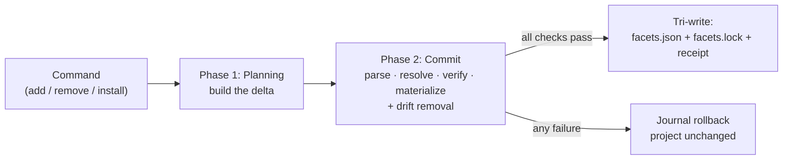

import { DeltaTip } from "/snippets/glossary.jsx";

Installation is a single pipeline with two phases. **[Planning](/specification/planning)** builds a <DeltaTip>delta</DeltaTip> — what should change. **[Commit](/specification/commit)** applies it — resolving versions, verifying [integrity](/specification/integrity), materializing assets, and writing `facets.json`, `facets.lock`, and the install receipt together.

[`facet add`](/cli/add), [`facet remove`](/cli/remove), and [`facet install`](/cli/install) all run this same pipeline — they differ only in the delta they produce.

Before the pipeline runs, **every installed adapter's** declared adapter API MUST be inspected against the CLI's supported set. An incompatible or broken installed adapter MUST fail the operation before planning begins — before any adapter method is invoked and before any project write — with per-adapter diagnostics and the best available reinstall command for each entry. The commit phase then re-checks the adapters selected for the operation as defense-in-depth: the same incompatibility MUST fail at [Load state and gate](/specification/commit), before the per-facet loop and therefore before any Git or local facet build can invoke adapter metadata methods.

Project state MUST NOT be written unless every check passes: a failure anywhere in commit MUST roll back all materialization via the journal and leave the project exactly as it was.

<CardGroup cols={2}>
  <Card title="Planning" icon="route" href="/specification/planning">
    Phase 1 — build the delta. No version resolution, no lockfile reads, no project mutation.
  </Card>
  <Card title="Commit" icon="check" href="/specification/commit">
    Phase 2 — the transaction. Parse, resolve, verify, and materialize each facet; remove drift; write atomically.
  </Card>
</CardGroup>

<Info>
The [project manifest](/specification/project-manifest) MUST NOT be written ahead of the install. A failed operation MUST leave the project exactly as it was.
</Info>
