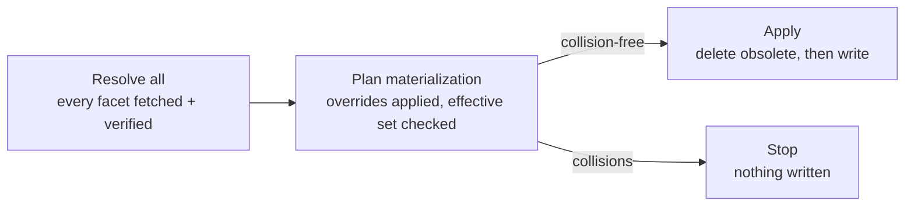

Materialization is the rule that turns what facets publish into the state a tool actually reads: files on disk for text assets, and keyed entries inside tool-owned configuration for [MCP server declarations](/specification/manifest#mcp-server-declarations). It sits inside [Commit](/specification/commit#compose), between verification and the first write.

Most of the time it is invisible: a facet publishes a skill named `planning`, and a file named `planning` appears. It becomes visible the moment two facets publish the same name, or a project decides it wants a published contribution under a different name — or not at all.

<Info>
Materialization decides **names**, never **content**. Every archive path, every integrity hash, every byte of an asset, and every field of a server declaration is fixed by its publisher and unaffected by anything on this page.
</Info>

## Two identities

Every asset has two names, and conflating them is the mistake this model exists to prevent.

<ResponseField name="authored name" type="fixed by the publisher">
  The name declared in the facet's [`facet.json`](/specification/manifest). It fixes the asset's canonical paths inside the [archive](/specification/archive) — `skills/<authored>/SKILL.md`, `agents/<authored>.md`, `commands/<authored>.md` — and therefore every [integrity](/specification/integrity) value recorded for it. It is what the [lockfile](/specification/lockfile) stores. Aliasing and omission never change it.
</ResponseField>

<ResponseField name="effective name" type="chosen by the project">
  The name the asset is materialized under: the file an [adapter](/specification/terminology#core-concepts) reads, writes, and deletes. It equals the authored name unless the consuming project aliased it.
</ResponseField>

An aliased skill therefore lives on disk under its **effective** name while its recorded file paths remain **authored**:

```
facet.json          skills/planning/SKILL.md      (authored — anchors integrity)
facets.lock         skills/planning/SKILL.md      (authored)
on disk             skills/team-planning/SKILL.md (effective)
```

Front matter follows the same split: the `name` field written into a materialized asset is the **effective** name, while `description` stays as the publisher wrote it. Renaming an asset does not rewrite it.

MCP servers have the same two identities. The **authored** server name is the key in the facet's `servers` map; it keys the project's override and the receipt's ownership claim. The **effective** server name is the key written into `.mcp.json`, `opencode.jsonc`, or `.codex/config.toml`. The declaration body itself is name-independent — its [canonical fingerprint](/specification/commit#machine-local-install-receipt) is computed without either name — so renaming a server never changes what it launches or connects to.

## Dispositions

A project resolves each authored contribution — asset or MCP server — to exactly one of three outcomes. The contract is identical for both; only what "materialize" means differs.

<ResponseField name="authored" type="the default">
  Materialize under the publisher's name. Expressed by recording **nothing** — the absence of an override *is* the authored disposition. An explicit `authored` override in [`facets.json`](/specification/project-manifest) MUST be rejected, so that one state has exactly one spelling.
</ResponseField>

<ResponseField name="aliased" type="{ kind: 'aliased', as }">
  Materialize under a different effective name. `as` is required and MUST satisfy the single-segment [asset-name grammar](/specification/manifest#asset-names). An invalid alias MUST be rejected, never normalized or sanitized — silently rewriting a chosen name would make the materialized identity unpredictable.
</ResponseField>

<ResponseField name="omitted" type="{ kind: 'omitted' }">
  Do not materialize this contribution, or any file it owns. An omitted asset is still resolved, still verified, and still recorded in the lockfile — it simply never reaches an adapter. An omitted **server** never reaches an adapter either, and is never approved or owned.
</ResponseField>

Two narrower forms are derived from these three arms:

- A **project override** admits only `aliased` and `omitted`, because `authored` is the absence of an override.
- A **materialized disposition** — what the [install receipt](/specification/commit#machine-local-install-receipt) records for an asset on disk or a configured server — admits only `authored` and `aliased`, because an omitted contribution was never materialized. "Omitted but present" is unrepresentable rather than merely invalid.

<Note>
An omitted asset stays listed in the lockfile with its complete authored file records. Dropping it would make an omission indistinguishable from a facet that never published the asset at all.

An omitted **server** leaves no lockfile trace at all — but for a different reason: the lockfile never records server declarations or dispositions in the first place. An omitted server is simply absent from the desired set, and its intent lives in `facets.json` alone.
</Note>

## Recording intent

Dispositions live in [`facets.json`](/specification/project-manifest) as durable project intent, keyed by contribution kind and then by **authored** name:

```json facets.json
{
  "manifestVersion": 0.2,
  "facets": {
    "team-tools": {
      "source": "1.*",
      "materialization": {
        "skills": {
          "planning": { "kind": "aliased", "as": "team-planning" },
          "scratch": { "kind": "omitted" }
        },
        "servers": {
          "filesystem": { "kind": "aliased", "as": "team-filesystem" },
          "docs": { "kind": "omitted" }
        }
      }
    }
  }
}
```

Overrides are keyed by authored name because that is the only stable identifier — an alias is the thing being declared, so it cannot also be the key.

Intent is durable. It survives a failed install, a re-add, and a change of source: changing *where* a facet comes from is not a statement about *how* its assets and servers should be named. It is discarded only when the facet is removed, or when the contribution it names disappears (see [Stale overrides](#stale-overrides)).

One server disposition applies to **every** selected adapter. There is no per-adapter aliasing or omission: a project decides once what a server is called, and each adapter writes that same effective name into its own document.

<Tip>
You rarely write this block by hand. [`facet add`](/cli/add) and [`facet install`](/cli/install) open an interactive resolver when they hit a collision and write your choices here. Hand-editing is the path for CI, where nothing can prompt.
</Tip>

## Namespaces

Two assets may share a name freely across namespaces, but never within one.

- **`skill-command`** — skills and commands compete for the same names, because they materialize into a single flat command surface in the tools facets target.
- **`agent`** — agents occupy their own namespace.

So a skill `deploy` and a command `deploy` collide, while an agent `deploy` coexists with both. This is the same rule a single facet's [`facet.json`](/specification/manifest#constraints) is validated against; materialization applies it across every facet in the project at once.

MCP servers are **not** an asset type and do not join either namespace. They occupy a separate **configuration identity** space — `(mcp-server, effective name)` at project scope — because they materialize into a different kind of destination: a key inside a tool-owned configuration document rather than a file the project owns. A server `deploy` therefore coexists with a skill, command, and agent all named `deploy`; it can only ever collide with another server.

## Collisions

Two assets collide when their **collision keys** are equal:

```
collisionKey = (scope, namespace, portable effective name)
```

Three properties of that key matter:

- It uses the **effective** name, so aliasing can both cause and cure a collision.
- It folds asset type into its **namespace**, giving the rule above.
- It folds the name **portably** — Unicode NFC, then case — so two assets differing only by case or normalization collide rather than silently overwriting each other on a case-insensitive volume.

A collision key is a *logical* identity and MUST NOT be handed to an adapter. The addressable identity is `(scope, type, effective name)`, keyed by asset type rather than namespace and by the verbatim effective name rather than a folded one: a skill `deploy` and a command `deploy` are two different files even though they may not legally coexist. For a server, the addressable identity is the verbatim effective server name.

### Server collisions

MCP servers collide by project scope and portable effective server name, evaluated in the same pre-write pass as assets. One difference is load-bearing, and it has no asset counterpart:

- **Identical declarations compose.** If two facets claim the same effective server name with declarations whose [canonical fingerprints](/specification/commit#machine-local-install-receipt) are equal, that is not a conflict. They produce **one** effective configuration, and both facets are retained as claimants for ownership and reporting. Two facets asking for the same server, spelled the same way, are in agreement — there is nothing for a user to resolve.
- **Different declarations collide.** If the fingerprints differ, the two claims describe materially different behavior at one key. That is one collision group naming every claimant, reported before any write, with no winner chosen.

Assets have no such rule because two assets at one name are two different files even when their content matches; a server key is a single entry that either says one thing or is contested.

### When collisions are detected

Detection is **global and pre-write**, and one pass covers both asset and server collisions. Every facet in the desired set is resolved and verified first; only then is the complete effective set checked, before any adapter is asked to write anything or any [MCP approval](/specification/commit#mcp-configuration) is requested.



This ordering is the reason the whole desired set must exist before the first write: a per-facet loop cannot detect that facet A and facet Z want the same name until it has already materialized A.

When the effective set does collide, the result carries **every** group with **every** claimant — never a truncated report, and never a generated winner. A tool that picked a winner would silently discard someone's asset.

## Planning rules

Materialization planning is a **single pass**, not a fixed-point resolver. Overrides are applied once against authored identity, then the resulting effective set is checked once. Assets and servers share one planning primitive, so every rule below holds identically in both identity spaces even though their domain types stay separate. Four consequences follow, and all four are normative:

- **Alias swaps are legal.** If `A` aliases to `B` and `B` aliases to `A`, both land. Neither observes the other's result, because there is no second pass.
- **Duplicate alias targets fail.** Two assets aliased to the same name collide like any other pair.
- **A name freed by an omission is available.** Omitting one claimant removes it from the effective set entirely.
- **Order does not matter.** The result never depends on the order facets were declared in.

A name that **every** claimant aliases away from is freed the same way an omission frees one: nothing in the effective set claims it. If your [install receipt](/specification/commit#machine-local-install-receipt) tracks that name, [drift removal](/specification/commit#drift-removal) deletes it in the same operation — before any alias is written — and each alias is written with its own facet's authored content. A file at that name the receipt does *not* track is left alone: freeing a name says nothing about who wrote the file sitting on it.

Determinism is a contract, and what it guarantees is **independence from declaration order**. Reordering the facets in `facets.json`, or the assets a facet declares, never changes the disposition an asset receives, whether a collision is detected, or which effective set is materialized. The same inputs plan to the same answer however they were enumerated — which is why no claimant can win a collision by being listed first.

Collision reports are additionally stable for presentation: groups, and the claimants within a group, come back in a fixed order, so the same unresolved conflict reads identically on every machine and on every rerun. That ordering is deliberately not locale-aware; locale-sensitive collation would make output depend on the machine's environment.

## Stale overrides

An override naming an asset or server the resolved facet version no longer contains is **stale** — typically because you upgraded a facet and the publisher renamed or dropped that contribution.

A stale override is reported, not fatal. Because intent is durable, it survives a failed operation and is pruned only as part of a successful commit — at which point the CLI tells you what it dropped. Under [`--frozen-lockfile`](/specification/commit#frozen-lockfile) the same report is blocking drift instead: frozen mode has no transaction to prune in, and silently ignoring recorded intent would defeat the flag's purpose.

## What aliasing does not change

Aliasing renames; it does not rewrite. Everything in this list is anchored to the **authored** name and is byte-identical whether or not an asset is aliased:

- Canonical inner-archive paths, and therefore the archive's per-entry hashes.
- The facet's canonical fingerprint (`content_integrity`).
- The lockfile's `name` and `files` records for the asset.
- The asset's content and its `description`.

For a server, aliasing likewise leaves the declaration body, its canonical declaration fingerprint, and the facet integrity that pins it unchanged. Because approval is keyed by effective name *and* fingerprint, aliasing a server to a name this machine has already approved for the same declaration does not re-prompt, while aliasing it to a new effective name does.

<Warning>
Because integrity is anchored to authored paths, an alias can never be used to smuggle different content under a familiar name. Verification happens before materialization and never sees the effective name. The same holds for a server declaration: it is verified as part of the integrity-protected manifest before any adapter is asked to write it.
</Warning>
