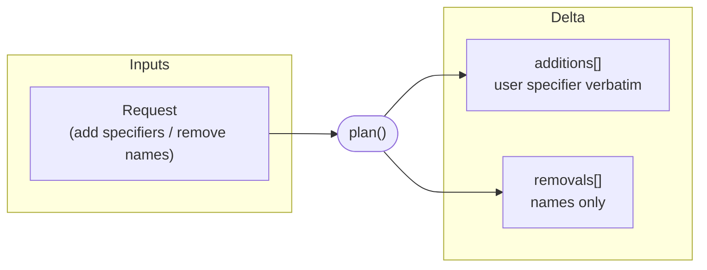
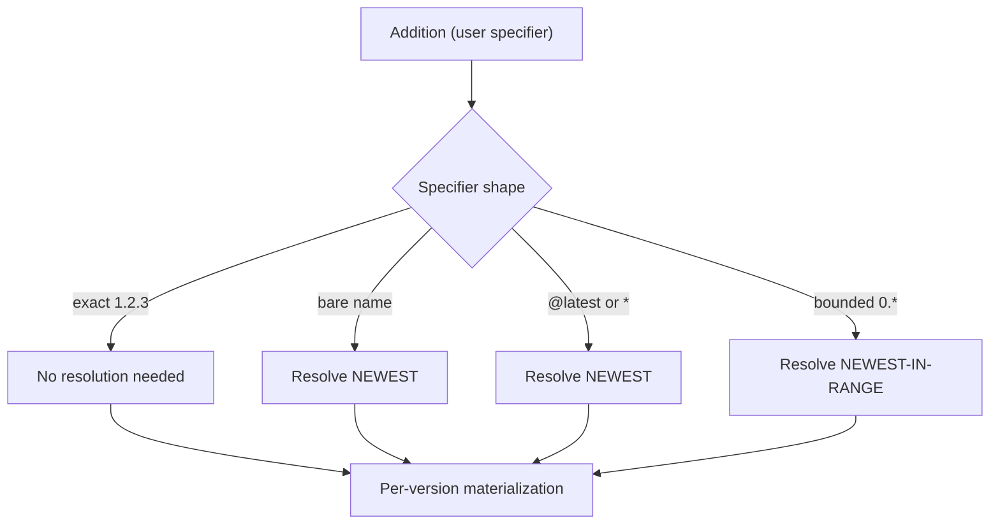
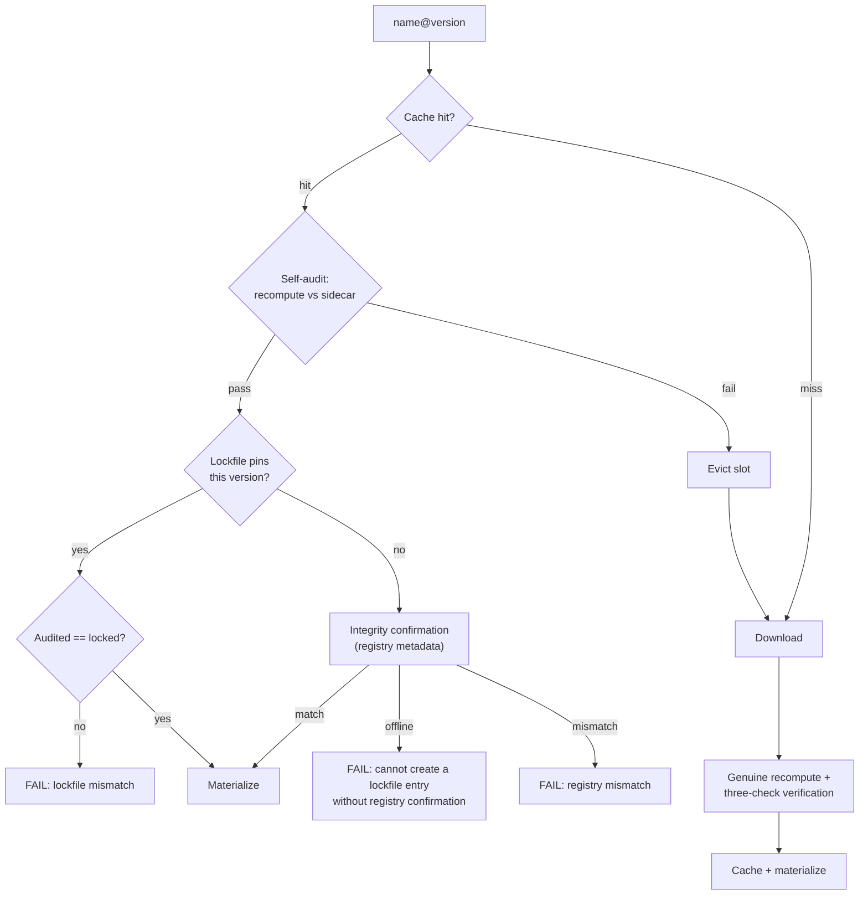
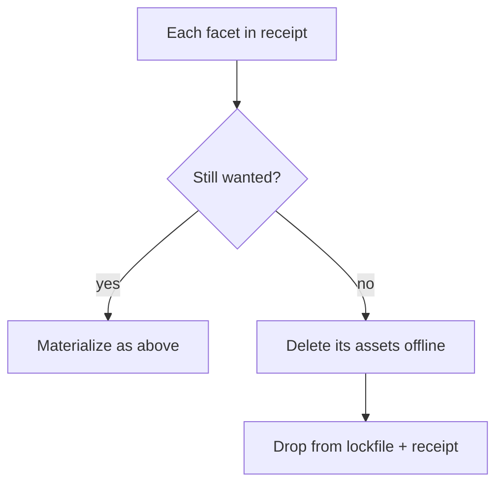
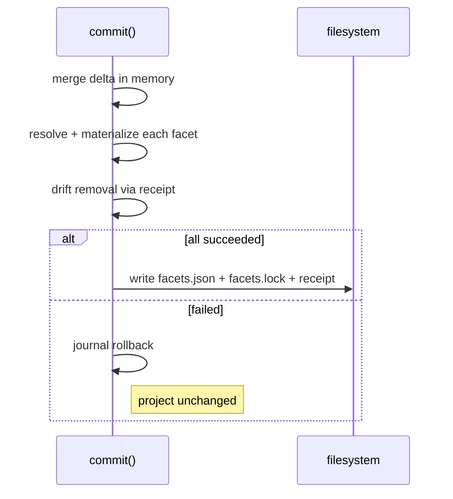

The install pipeline splits into two phases: **plan** (pure routing) and **commit** (all resolution, integrity verification, materialization, and writes). `facet add`, `facet remove`, and `facet install` all converge on the same commit phase — they differ only in the <Tooltip tip="A list of additions (with the user's specifier verbatim) and removals (bare names). facet install produces an empty delta.">delta</Tooltip> they produce.

<CardGroup cols={3}>
  <Card title="Plan" icon="route">
    Pure routing. Produces additions + removals. No network, no cache, no lockfile.
  </Card>
  <Card title="Commit" icon="check">
    Resolves, verifies, materializes, and writes manifest + lockfile + receipt atomically.
  </Card>
  <Card title="Frozen" icon="lock">
    Lockfile is authoritative. No mutations to the locked set. Receipt-only writes.
  </Card>
</CardGroup>

## Plan phase

Plan turns a user request into a **delta** — a list of additions and removals.

<Info>
Plan performs **no network I/O, no lockfile lookups, no cache reads, and no version resolution.** Its only job is to determine what is changing. All resolution is the commit phase's responsibility.
</Info>

| Delta field | Contents | Source command |
| --- | --- | --- |
| **Additions** | User's specifier verbatim (`1.2.3`, `0.*`, `*`, `latest`, or bare name) | `facet add` |
| **Removals** | Bare facet names | `facet remove` |
| _(empty)_ | No additions, no removals | `facet install` |

The specifier is passed through untouched. Plan does not decide what version a wildcard or `latest` resolves to — that decision belongs to commit. The <Tooltip tip="The mechanism that determines lockfile trust: additions are explicit requests (lockfile not trusted for version resolution); manifest entries are reproductions (lockfile trusted when satisfying)." cta="See terminology" href="/specification/terminology">structural discriminator</Tooltip> is established here: anything in additions is an explicit user request; anything commit later reads from the manifest but not in additions is reproduction.

## Commit phase

Commit applies the delta to the project. Its inputs are the on-disk `facets.json`, `facets.lock`, the <Tooltip tip="A per-project, machine-local record under $FACET_DIR/receipts/ tracking what has been materialized. Separate from the lockfile. Drives offline drift removal." cta="See receipt section" href="#machine-local-install-receipt">install receipt</Tooltip>, and the delta from plan.

<Steps>
  <Step title="Merge delta in memory">
    The on-disk manifest is read, additions are upserted, removals are deleted — all in memory. The on-disk `facets.json` is **never written ahead** of the install.
  </Step>
  <Step title="Resolve and materialize each facet">
    For each facet in the desired set, the commit phase resolves the version (if needed), checks the cache, verifies integrity, and materializes assets into every selected adapter. See the sections below for detail on each sub-step.
  </Step>
  <Step title="Drift removal">
    Facets the receipt records as materialized but the desired set no longer wants are removed offline.
  </Step>
  <Step title="Transactional tri-write">
    On success, `facets.json`, `facets.lock`, and the install receipt are written together. A failure anywhere rolls back all materialization via the journal and leaves all three files unchanged.
  </Step>
</Steps>

### Three registry interactions

Commit makes three distinct kinds of registry interaction, gated independently:

<AccordionGroup>
  <Accordion title="Version resolution" icon="search">
    Determines the exact version a specifier refers to (turning `0.*`, `*`, `latest`, or a bare name into a concrete `X.Y.Z`).

    **Needed only when no exact version is already known.** An exact specifier needs none; a satisfying lockfile entry needs none.
  </Accordion>
  <Accordion title="Archive resolution" icon="download">
    Downloads the archive bytes for an exact `name@version`.

    **Needed only on a cache miss.** A warm cache skips it entirely, regardless of how the exact version was obtained.
  </Accordion>
  <Accordion title="Integrity confirmation" icon="shield-check">
    Verifies the cached or downloaded content against the registry's published <Tooltip tip="SHA-256 of the canonical uncompressed inner tar archive. The domain the lockfile, cache sidecar, and build manifest all record." cta="See integrity model" href="/specification/integrity">canonical fingerprint</Tooltip> (`content_integrity`).

    **Needed only when a lockfile entry is being created or replaced.** A satisfying lockfile entry serves as the trust anchor instead. An unreachable registry fails the operation rather than writing an unconfirmed entry.
  </Accordion>
</AccordionGroup>

These compose independently: a step may need any combination, or none. The cache short-circuits archive resolution; a satisfying lockfile entry short-circuits integrity confirmation.

<Info>
Registry versions are immutable — the bytes for a published `name@version` never change. Integrity confirmation and lockfile comparison enforce this invariant **client-side** rather than assuming it.
</Info>

### The structural discriminator

Whether the lockfile is trusted for version resolution depends on **where an entry comes from**, not on a flag:

<AccordionGroup>
  <Accordion title="Additions (explicit request)" icon="plus">
    The lockfile is **NOT trusted** for version resolution. A non-exact specifier always triggers version resolution to the newest matching version, even when the lockfile already satisfies it.

    The user explicitly asked for this facet — we honor the request.
  </Accordion>
  <Accordion title="Manifest (reproduction)" icon="repeat">
    The lockfile **IS trusted** when satisfying. A satisfying recorded version needs no version resolution. Only an absent or stale entry triggers it.

    The facet was already declared — we reproduce the locked state.
  </Accordion>
</AccordionGroup>

In both cases, once an exact version is in hand, the cache is checked first and archive resolution happens only on a miss.

### Per-version materialization

Once a fully-qualified version is in hand, the cache and integrity path is identical regardless of how the version was obtained.

<Note>
A cache hit is **never taken at face value**. Three checks layer on the hit path, each catching what the previous cannot.
</Note>

<Steps>
  <Step title="Cache self-audit">
    Recompute the cached content's hashes (per-asset and canonical archive) against the <Tooltip tip="A cache-integrity.json file stored alongside cached content. Contains the canonical fingerprint and per-asset hashes.">integrity sidecar</Tooltip> written at populate time. A failure **evicts the slot** and falls through to a download. Tampered content is never materialized.
  </Step>
  <Step title="Lockfile comparison">
    When the lockfile pins this version, the audited integrity must equal the locked integrity (string comparison). A mismatch is a **hard failure** — the highest-priority check. Not a silent re-download.
  </Step>
  <Step title="Integrity confirmation">
    When **no** satisfying lockfile entry exists, the audited integrity must equal the registry's published `content_integrity`. An unreachable registry **fails the commit**: a lockfile entry is never written on trust.
  </Step>
</Steps>

On a miss, the downloaded content's canonical fingerprint is **genuinely recomputed** from the extracted bytes (per-asset hashes plus the canonical-archive hash) — never taken from the build manifest's self-declared claim. The recomputed value is verified against the registry's published `content_integrity` and, when the lockfile pins this version, against the locked integrity, before the verified content populates the cache.

### Manifest-write policy

The manifest value written for an addition depends on the specifier shape:

| Specifier                                | Manifest value                     | Lockfile value             |
|------------------------------------------|------------------------------------|----------------------------|
| Bare name (no version)                   | Pinned to resolved exact (`1.2.3`) | Resolved exact + integrity |
| Explicit (`1.2.3`, `0.*`, `*`, `latest`) | Written verbatim                   | Resolved exact + integrity |
| Reproduction (not an addition)           | Unchanged                          | Unchanged or re-resolved   |

### Machine-local install receipt

Receipts are per-project, machine-local records stored outside the project's version-controlled tree (`$FACET_DIR/receipts/`). They track what has been materialized so drift removal can clean up correctly — even when the lockfile no longer mentions the facet.

<CardGroup cols={2}>
  <Card title="Per-project isolation" icon="folder">
    Each project has its own receipt, identified by a hash of the project's canonical path. Two projects never share a receipt.
  </Card>
  <Card title="Self-identifying" icon="fingerprint">
    The receipt embeds the canonical path. A mismatch on load fails closed — treated as absent and re-bootstrapped from the lockfile.
  </Card>
  <Card title="Untrusted input" icon="shield">
    Asset entries with crafted names (path traversal, backslashes) are **reported and skipped individually** — the rest of the receipt still loads and is processed. A corrupted entry can cause a skipped cleanup, never a deletion outside the project's adapter trees.
  </Card>
  <Card title="Contained deletion" icon="box">
    Deletion goes through adapters using validated semantic asset tuples — never raw filesystem paths taken from the receipt.
  </Card>
</CardGroup>

### Drift removal

Anything the receipt records as materialized but the desired set no longer wants is removed. The comparison is against the **receipt**, not the on-disk lockfile — this is what makes orphan-on-pull recoverable. The asset tuples to delete come from the receipt, so removal needs no cache and no network.

### Transactional tri-write

On success, three files are written together: the manifest, the lockfile, and the receipt. A failure anywhere leaves all three exactly as they were.

<Note>
A failed operation leaves the project exactly as it was — no snapshot/restore needed.
</Note>

## Frozen lockfile

Frozen mode (`--frozen-lockfile`) treats the lockfile as the complete, authoritative source of truth.

<Warning>
A frozen commit with a non-empty delta (any addition or removal) is **rejected immediately**. Only a plain `facet install` can run frozen.
</Warning>

| Behavior                         | Frozen mode                                          |
|----------------------------------|------------------------------------------------------|
| Additions or removals            | Rejected                                             |
| Version resolution               | Forbidden — absent/stale entry fails immediately     |
| Integrity confirmation           | Never fires (no entry creation)                      |
| Archive resolution               | Allowed (downloading locked content is reproduction) |
| Bidirectional consistency        | Required (manifest ↔ lockfile)                       |
| Integrity before materialization | Required for every facet (including local sources)   |
| Drift removal                    | Runs; receipt is rewritten                           |
| Lockfile write                   | Never                                                |
| Manifest write                   | Never                                                |
