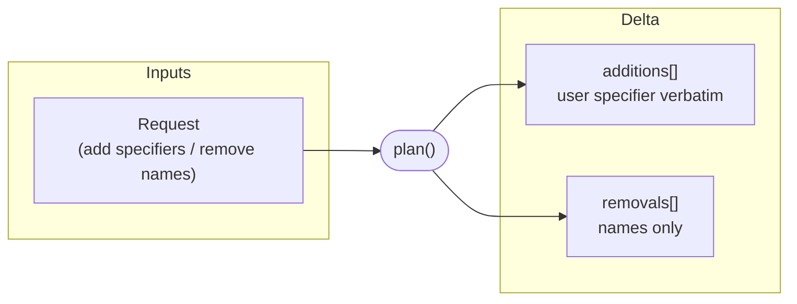

import { DeltaTip } from "/snippets/glossary.jsx";

Planning is phase 1 of the [install pipeline](/specification/install): turn a command into a <DeltaTip>delta</DeltaTip>. It is thin by design — all resolution, verification, and mutation belong to [Commit](/specification/commit).

<Info>
    Planning performs **no version resolution, no lockfile lookups, no project mutation, and takes no install lock.**

    Its only job is to determine what is changing. Discovering a git or local facet's *name* can fetch the source (see below) — but nothing about versions is decided here, and nothing in the project is touched.
</Info>

## The delta

Plan turns a user request into a **delta** — a list of additions and removals.

| Delta field | Contents                                                                | Source command  |
|-------------|-------------------------------------------------------------------------|-----------------|
| _Additions_ | User's specifier verbatim (`1.2.3`, `0.*`, `*`, `latest`, or bare name) | `facet add`     |
| _Removals_  | Bare facet names                                                        | `facet remove`  |
| _(empty)_   | No additions, no removals                                               | `facet install` |

The specifier is passed through untouched. Plan does not decide what version a wildcard or `latest` resolves to — that decision belongs to commit. The <Tooltip tip="The mechanism that determines lockfile trust: non-exact additions never trust the lockfile for version resolution; reproductions and exact additions do." cta="See terminology" href="/specification/terminology#install-pipeline">structural discriminator</Tooltip> is *established* here and *applied* during commit's [resolve sub-stage](/specification/commit#resolve): anything in additions is an explicit user request; anything commit later reads from the manifest but not in additions is reproduction.

## What each command prepares

**`facet add`** resolves each source's facet name and builds the additions list. For registry sources the name comes from the specifier itself. For git and local sources the name lives in the source's `facet.json`, so preparation MAY **clone the repository or read the local path** to discover it. Still no version resolution and no project writes.

**`facet remove`** is read-only validation: it loads the manifest and filters the requested names against the facets it actually declares, producing the removals list.

**`facet install`** has no preparation at all — an empty delta. The commit phase reproduces the declared set.

## Accepted source kinds

Each addition specifier is parsed into one of three tagged source kinds before commit:

- **`registry`** — `name@range`. A registry facet: `cowsay`, `cowsay@1.*`, `cowsay@latest`. The default when no other shape matches.
- **`git`** — a full git URL (`https://…`, `git@…`) with an optional `#ref` (branch, tag, or commit). The shorthand `github:owner/repo#ref` is accepted and normalizes to this kind.
- **`local`** — a directory path, resolved relative to the project.

<Note>
Caret, tilde, and comparator ranges (`^1.2.0`, `~1.2.0`, `>=1.2.0`) MUST be rejected. Only exact versions, bounded wildcards (`1.*`, `1.2.*`), the open wildcard (`*`), and `latest` are accepted. The user-facing grammar, including every accepted and rejected shape, is documented at [`facet add`](/cli/add#source-grammar).
</Note>
