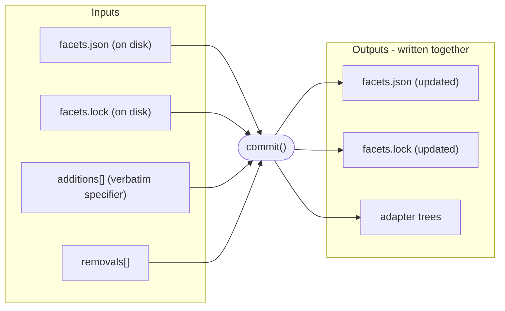
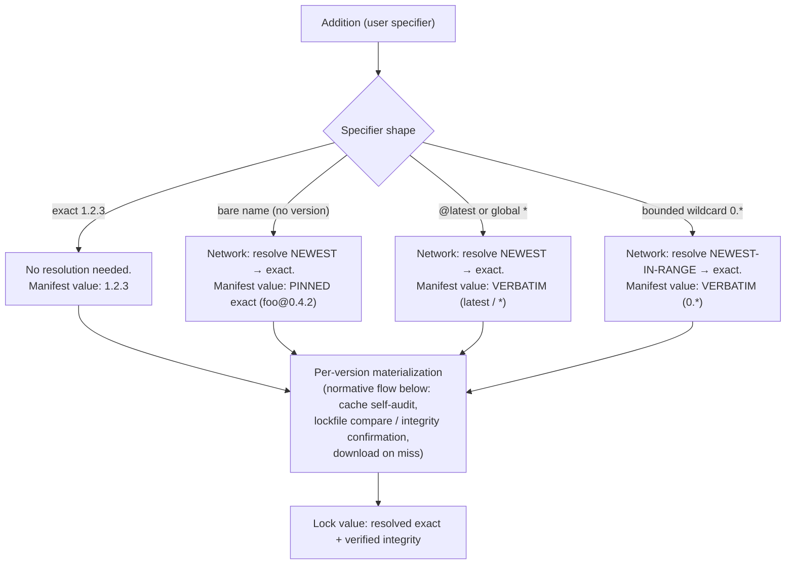
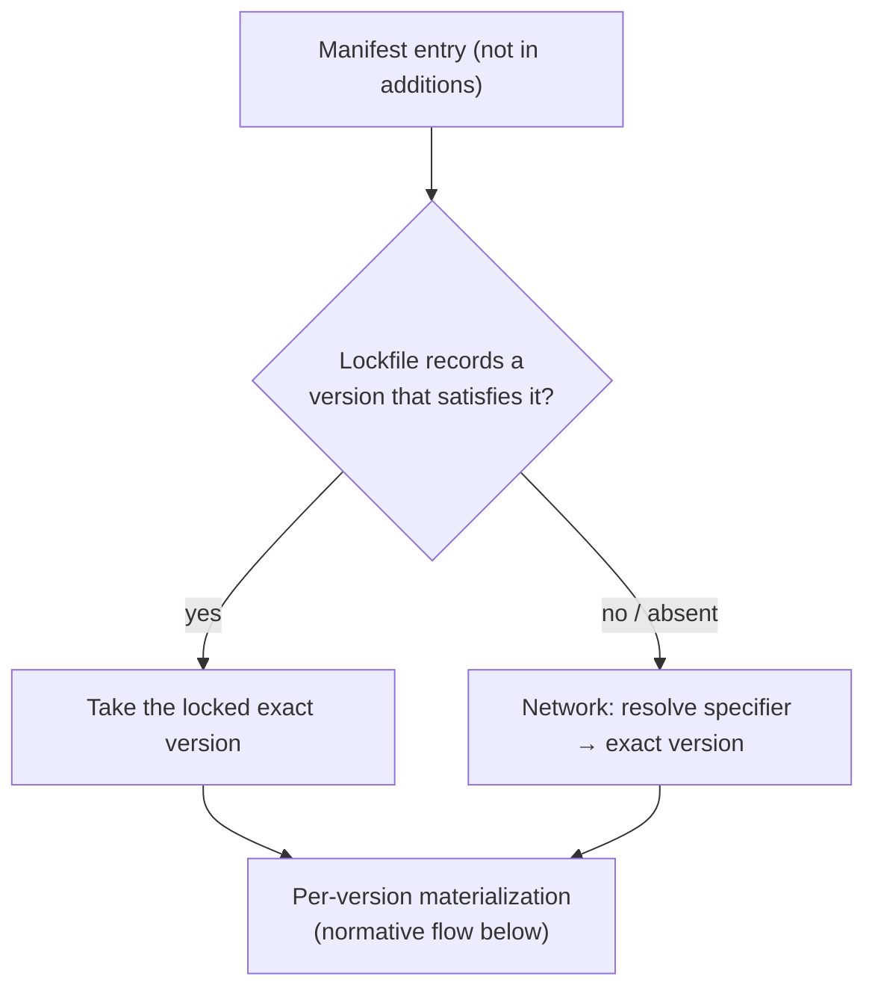
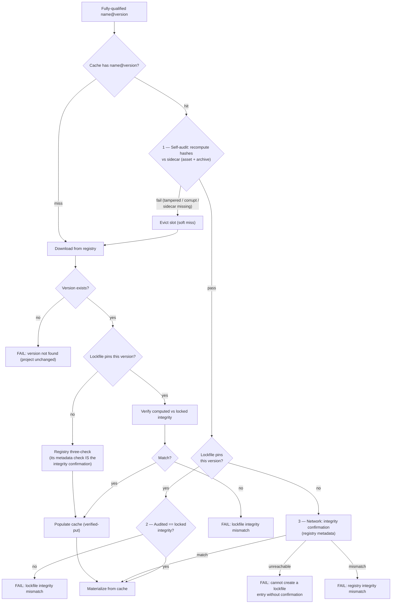
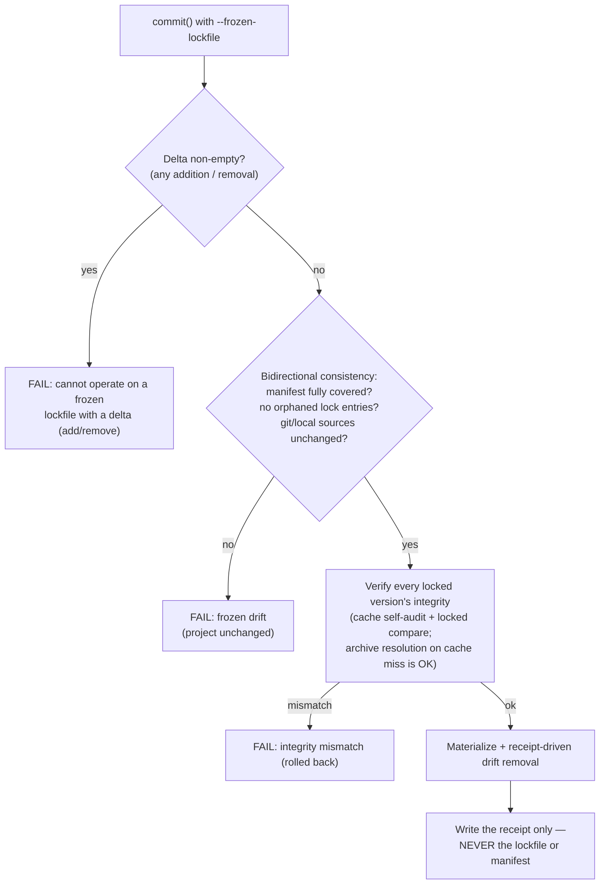
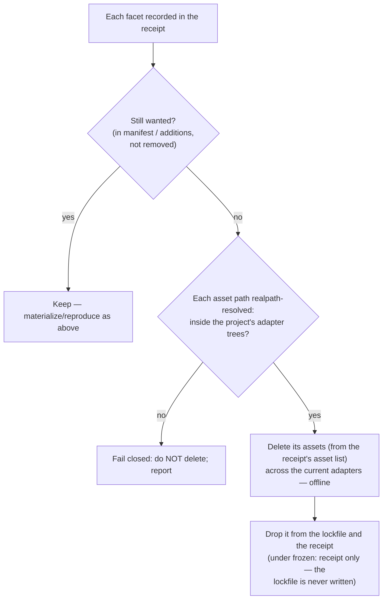
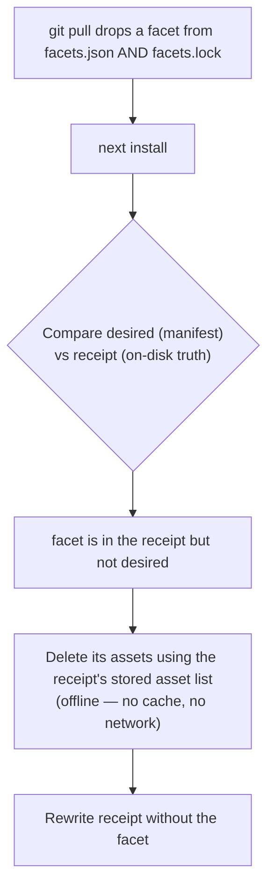
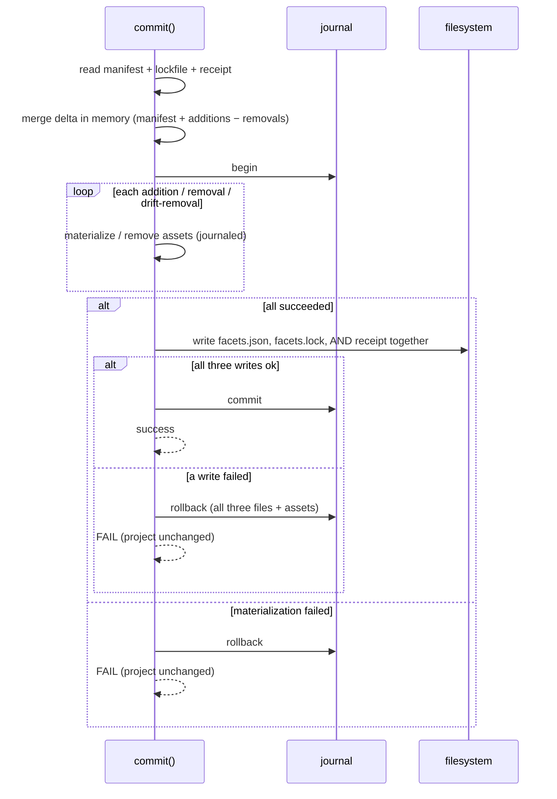

# Committing phase

The **commit** phase applies the delta to the project and makes it real on
disk. Its inputs are the on-disk `facets.json`, the on-disk `facets.lock`,
the machine-local **install receipt**, and the delta from planning:

- **additions** — facets the user explicitly requested, each with the user's
  specifier verbatim (exact, `0.*`, `*`, `latest`, or bare)
- **removals** — names

Commit owns **all** resolution, cache lookups, integrity checks, and the
atomic write of all three files. `add`, `remove`, and `install` all reach the
same commit step; they differ only in the delta.

## Three kinds of registry interaction

Commit makes three *distinct* kinds of registry interaction, gated
independently. Keeping them separate is essential to reasoning about this
phase:

- **Version resolution** — asking the registry what exact version a
  specifier means (turning `0.*`, `*`, `latest`, or a bare name into a
  concrete `X.Y.Z`). Needed **only when no exact version is already known**.
  An exact specifier needs none; a satisfying lockfile entry needs none (it
  already records the exact version).
- **Archive resolution** — downloading the actual archive bytes for an exact
  `name@version`. Needed **only on a cache miss**. A warm cache skips it
  entirely, no matter how the exact version was obtained.
- **Integrity confirmation** — asking the registry's metadata API for the
  published **canonical content fingerprint** of an exact `name@version`
  and comparing it against the content about to be installed. (This is the
  hash over the canonical archive — the same domain the sidecar, lockfile,
  and build manifest record — NOT the uploaded-tarball hash the metadata
  body's `content_hash` carries, which hashes delivery bytes and is used
  only for the raw-download transport check. The fingerprint is the
  `content_integrity` field of version metadata, already served by the
  deployed registry API.) Needed
  **only when a lockfile entry is being created or replaced** — i.e., when
  no satisfying lockfile entry already anchors the content. It rides the
  same metadata response as version resolution, so every path that
  resolved a version gets confirmation for free; the only path that pays a
  *new* network call is an exact specifier served from a warm cache with
  no satisfying lockfile entry — and that path **fails offline** rather
  than writing an unconfirmed lockfile entry.

These compose: a step may need any combination, or none. The cache
short-circuits **archive** resolution regardless of how the version was
determined; a satisfying lockfile entry short-circuits **integrity
confirmation** (the entry *is* the trust anchor). Registry versions are
immutable — the bytes for a published `name@version` can never change —
and integrity confirmation plus the lockfile comparison below are how
commit *enforces* that invariant client-side instead of assuming it.

## The structural discriminator: additions vs. manifest

This is the heart of the design. Whether the lockfile is trusted depends on
**where an entry comes from**, not on a flag:

- **In `additions`** → an explicit user request → **the lockfile is NOT
  trusted.** A non-exact specifier always triggers **version resolution**
  (newest, or newest-in-range). The user asked; we honor it.
- **From the manifest, not in additions** → reproduction → **the lockfile IS
  trusted.** When a recorded version satisfies the entry, **no version
  resolution** happens — the lockfile already gives the exact version.
  Version resolution is triggered only when the lockfile cannot supply a
  satisfying exact version, which happens two ways:
  - **Absent** — the manifest declares a facet with no lockfile entry at all
    (a hand-added manifest line, or a fresh-clone gap).
  - **Stale** — a lockfile entry exists, but the manifest specifier has
    changed so the recorded version no longer satisfies it. Example:
    `facets.json` was hand-edited from `foo@1.*` to `foo@2.*` while the
    lockfile still records `foo@1.4.0`; `1.4.0` does not satisfy `2.*`, so the
    entry is stale and `2.*` is re-resolved.

In **both** cases, once an exact version is in hand, **archive resolution
still happens on a cache miss** — a satisfying lockfile entry avoids version
resolution but does not avoid downloading bytes the cache lacks.

So `add foo@0.*` (in additions) re-resolves to the newest in-range even if
the lockfile already satisfies `0.*` with an older version, while a plain
`install` of `foo@0.*` already in the manifest reproduces the satisfying
locked version. Same specifier, different source, different behavior — and
commit can always tell them apart because they arrive through different
inputs.

## Inputs and outputs



## Resolving an ADDITION (lockfile NOT trusted)



The **manifest-write policy** is the only place bare and `@latest` diverge:
a bare add is **pinned** to the resolved exact in `facets.json`; an explicit
`@latest`/`*`/`0.*` is written **verbatim** and floats. Both write the
resolved exact **and its verified integrity** to `facets.lock`.

Note that "additions never trust the lockfile" applies to **version
resolution only** — integrity is stricter, not looser, for additions: an
added version the lockfile already pins must still match the locked
integrity, and an added version the lockfile does *not* pin must be
confirmed against the registry before its entry is written.

## Reconciling a MANIFEST entry (lockfile trusted) — plain install



A satisfying entry enters the shared flow with the lockfile as its trust
anchor (offline-capable on a warm cache); an absent/stale entry enters it
as a lock-entry creation, with integrity confirmation riding the version
resolution it already performed.

## Per-version materialization (shared, normative)

Once a fully-qualified version is in hand (from either path above), the
cache/integrity step is identical — this flow is the **single normative
sequence**; the materialization boxes in the two diagrams above are
shorthand for it. The cache is keyed on the **version**, never on a
lockfile entry — this is what fixes the original bug.

A cache hit is **never taken at face value**. Three checks layer on the
hit path, each catching what the previous cannot:

1. **Cache self-audit** — recompute the cached content's hashes (per-asset
   and the canonical-archive hash) and compare them against the integrity
   sidecar written at populate time. Catches tampered or corrupted cache
   bytes. A failure **evicts the slot and becomes a miss** (re-download);
   tampered content is never materialized and never seeds a lockfile entry.
2. **Lockfile comparison** — when the project's lockfile pins this version,
   the audited integrity must equal the locked integrity (a string
   comparison; the recompute already happened in step 1). Catches a
   coordinated rewrite of cache bytes *and* sidecar, and enforces registry
   immutability client-side. A mismatch is a **hard failure** (the
   highest-priority `lockfile` check), not a silent re-download.
3. **Integrity confirmation** — when **no** satisfying lockfile entry
   exists (the entry is being created), the audited integrity must equal
   the registry's published integrity for this exact version, fetched from
   the metadata API. An unreachable registry **fails the commit**: a
   lockfile entry is never written on trust.



The unifying invariant: **a lockfile entry for a registry facet is never
created or replaced without same-operation registry confirmation of its
integrity** — the three-check on a fresh download, or the metadata
confirmation on a warm-cache hit. Once an entry exists it is the trust
anchor, and reproducing it is fully offline-capable on a warm cache.

## Frozen lockfile (`--frozen-lockfile`)

Frozen mode treats the lockfile as the complete, authoritative source of
truth: reproduce exactly what is locked, change nothing about the **locked
set**. It draws its line precisely on the three-registry-interaction
distinction:

- **A frozen commit with a non-empty delta is rejected immediately.** A
  delta (any addition or removal) is by definition a change to the locked
  set, which frozen mode forbids. `add` and `remove` therefore can never run
  frozen; only a plain `install` (empty delta) can.
- **Version resolution is forbidden under frozen mode — it is an immediate
  failure.** Version resolution only ever occurs when the lockfile cannot
  supply a satisfying exact version (an absent or stale entry), which is
  exactly the drift frozen mode exists to reject. So any entry that would
  require version resolution fails the frozen commit, leaving the project
  unchanged.
- **Integrity confirmation never fires.** Confirmation exists only for
  lockfile-entry creation, and frozen mode refuses to create entries — so
  a frozen install never needs the metadata API. Its only possible network
  activity is archive resolution.
- **Archive resolution is allowed.** Downloading bytes the cache lacks for an
  already-locked exact version is pure materialization, not drift. A frozen
  install on a fresh clone with a cold cache downloads normally.
- **Consistency is checked bidirectionally, before anything is touched**:
  every manifest entry must have a satisfying lockfile entry; the lockfile
  must pin no facet the manifest no longer declares (an orphaned entry a
  non-frozen install would prune); and a git/local facet's manifest source
  string must match its locked provenance. Any violation fails the commit
  with the project unchanged.
- **Integrity is verified before materialization.** Every facet — cache
  hit, fresh download, or local build — must reproduce its locked
  integrity. Cache hits go through the same self-audit recompute as
  everywhere else, so frozen reproduction is byte-exact, not
  sidecar-trusting. A verification failure rolls back with the project
  unchanged.
- **Drift removal still runs.** Frozen forbids changing the locked set
  (manifest + lockfile); the adapter trees and the machine-local receipt
  are *materialization state* — exactly what frozen mode exists to
  converge. A facet the receipt records as materialized but the
  manifest/lockfile no longer want (e.g. dropped by a `git pull`) is
  cleaned up as in a normal install, and the **receipt is rewritten**. The
  lockfile and manifest are still never written.



## The install receipt and drift removal

Everything above resolves and materializes what the project *wants*. The
remaining job is to remove what it no longer wants — and that is where the
on-disk lockfile is not enough.

The lockfile is shared and version-controlled, so it cannot serve as the
record of *what this machine has actually materialized* — a `git pull` can
delete a lockfile entry out from under a working copy whose adapter trees
still hold that facet's assets. To clean up correctly, commit consults a
**machine-local install receipt** instead.

- **Location:** one machine-local file **per project**, stored outside
  every project's version-controlled tree (e.g. under `~/.facet/receipts/`).
  It is never in git by construction, so it survives every git operation.
  Per-project files mean commits in different projects never contend on a
  shared file (no cross-project read-modify-write race; same-project
  concurrency remains covered by the existing project lock).
- **Keying:** the filename is `<basename>-<hash>.json`, where `<hash>` is a
  truncated SHA-256 of the **canonical project path** — the `realpath` of
  the directory containing `facets.json`, resolved *before* hashing so
  symlinked and case-variant spellings of one project converge on one
  receipt, and two different projects can never share one. The basename
  slug is cosmetic (it keeps the directory human-listable); the hash alone
  is the identity.
- **Self-identification:** the receipt stores the canonical project path
  *inside* the file. On load, commit verifies the embedded path matches the
  project being operated on; any mismatch (corruption, hash collision,
  manual tampering) **fails closed** — the receipt is treated as absent and
  re-bootstrapped, and **nothing is ever deleted on its say-so**.
- **Contents:** per facet, `{ name, version, assets[] }` — the asset tuples
  actually written. It is **adapter-agnostic** (install and remove run
  idempotently across the current adapter set and converge). Storing the
  asset list makes the record a **self-sufficient deletion record**:
  removal needs neither the cache nor the network to know what to delete.
- **Deletion containment:** the receipt is treated as **untrusted input**.
  Every asset path taken from it is resolved (symlinks included) before
  deletion and must land inside the project's adapter trees. A path that
  escapes — `..` traversal, an absolute path outside the project, a
  symlinked hop out — is **never deleted**; the entry fails closed and is
  reported. A corrupted receipt can cause the system to *skip* a cleanup,
  never to delete outside its sandbox.
- **Role:** the receipt — **not** the on-disk lockfile — is the "previous
  on-disk state" that drift removal compares against. The lockfile is purely
  the reproducibility record.
- **Migration & moves:** a project with no receipt bootstraps one on its
  first commit, seeded from the current lockfile's entries (which record
  asset tuples; best-effort — it records what *should* be on disk). Moving
  or renaming a project changes its canonical path and therefore its
  receipt key: the old receipt is orphaned (safely prunable — its embedded
  path no longer exists) and the moved project bootstraps a fresh receipt
  from its lockfile on the next commit.

Shape (illustrative):

```json
// ~/.facet/receipts/my-app-3fa9c2d1e07b.json
{
  "path": "/home/me/dev/my-app",
  "facets": { "cowsay": { "version": "0.0.1", "assets": [] } }
}
```

**Drift removal.** Anything the receipt records as materialized on this
machine that the desired set (manifest + additions − removals) no longer
wants is removed. The comparison is against the receipt, never the on-disk
lockfile — that is what makes orphan-on-pull recoverable. The asset tuples to
delete come from the receipt's stored asset list, so removal needs no cache
and no network.



**Orphan-on-pull, fixed.** A change pulled from version control can drop a
facet from both `facets.json` and `facets.lock`, but it cannot touch the
machine-local receipt — so the next commit still sees the facet as
materialized and cleans it up.



## The transactional tri-write

No write-ahead of `facets.json`. Three files are written together under the
journal — the manifest, the lockfile, and the machine-local receipt. A
failure anywhere above leaves all three exactly as they were.



## Invariants

- Commit owns **all** version resolution, archive resolution, integrity
  confirmation, cache lookups, and integrity. Plan hands off only the user's
  verbatim specifier (additions) and names (removals).
- **Version resolution, archive resolution, and integrity confirmation are
  independent.** Version resolution (specifier → exact version) is needed
  only when no exact version is already known; archive resolution (download
  bytes) is needed only on a cache miss; integrity confirmation (registry
  metadata vs. content) is needed only when a lockfile entry is created or
  replaced. A step may need any combination, or none.
- **Additions never trust the lockfile for version resolution.** A non-exact
  addition ALWAYS triggers version resolution (newest / newest-in-range),
  even when the lockfile already satisfies it. For **integrity** the rule
  tightens, never loosens: an added version the lockfile pins must match the
  locked integrity; one it does not pin must be confirmed against the
  registry before its entry is written.
- **Manifest entries not in additions trust the lockfile.** A satisfying
  locked version needs **no version resolution**. Version resolution is
  triggered only when the lockfile cannot supply a satisfying exact version —
  either **absent** (no lockfile entry) or **stale** (an entry whose recorded
  version no longer satisfies a changed manifest specifier). Either way,
  archive resolution still occurs on a cache miss.
- The cache is keyed on the **fully-qualified version**, never on a lockfile
  entry. A cache hit skips archive resolution (no download) regardless of how
  the exact version was obtained.
- **A cache hit is never taken at face value.** Every materialization from
  cache recomputes the content's hashes against the integrity recorded at
  populate time; a failure evicts the slot and re-downloads. Tampered cache
  bytes never reach an adapter tree or seed a lockfile entry.
- **A registry lockfile entry is never created or replaced without
  same-operation registry confirmation of its integrity** — the download
  path's three-check, or the warm-cache path's metadata confirmation. The
  one consequence: an exact add with a warm cache but no satisfying lockfile
  entry makes a metadata call and fails offline. Reproduction of an existing
  entry needs no confirmation and works offline on a warm cache.
- **Manifest-write policy:** a bare add is pinned to the resolved exact in
  `facets.json`; an explicit specifier (`1.2.3`, `0.*`, `*`, `latest`) is
  written verbatim. The lockfile always records the resolved exact and its
  verified integrity.
- Integrity is the commit phase's job, derived from the lockfile it already
  loads. A fully-qualified version absent from the registry fails the commit.
- **Drift removal compares against the machine-local receipt, not the on-disk
  lockfile.** A facet the receipt records but the desired set no longer wants
  is removed using the receipt's stored asset list — offline, with no cache
  or network. This is what makes a `git pull` that drops a lockfile entry
  recoverable rather than leaving orphaned assets.
- **The receipt is machine-local, per-project, and never version-controlled**
  — one file per project keyed by a hash of the canonical (realpath) project
  directory, self-identifying via its embedded path, adapter-agnostic,
  storing `{ name, version, assets[] }` per facet. A project with no receipt
  bootstraps one from the lockfile on its first commit.
- **The receipt is untrusted input and deletion is contained.** A receipt
  whose embedded path does not match the project fails closed (treated as
  absent, re-bootstrapped — never acted on). Every asset path is
  realpath-resolved and must fall inside the project's adapter trees;
  escaping paths are reported, never deleted.
- `facets.json`, `facets.lock`, and the receipt are written together as one
  transaction; any failure rolls back all three. No write-ahead
  snapshot/restore.
- **Frozen mode rejects any non-empty delta.** A frozen commit with an
  addition or removal fails immediately; only a plain `install` (empty delta)
  can run frozen.
- **Frozen mode forbids version resolution and never needs integrity
  confirmation.** Any entry that would require version resolution (an
  absent or stale lockfile entry), any orphaned lockfile entry, and any
  changed git/local source string fails a frozen commit immediately.
  Archive resolution (cache-miss download of an already-locked version) is
  allowed. Every facet is verified against its locked integrity before
  materialization.
- **Frozen mode converges materialization state but never the locked set.**
  Receipt-driven drift removal runs under frozen and rewrites the receipt;
  the lockfile and manifest are never written.
