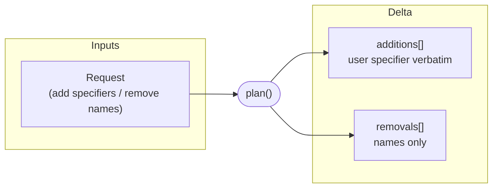
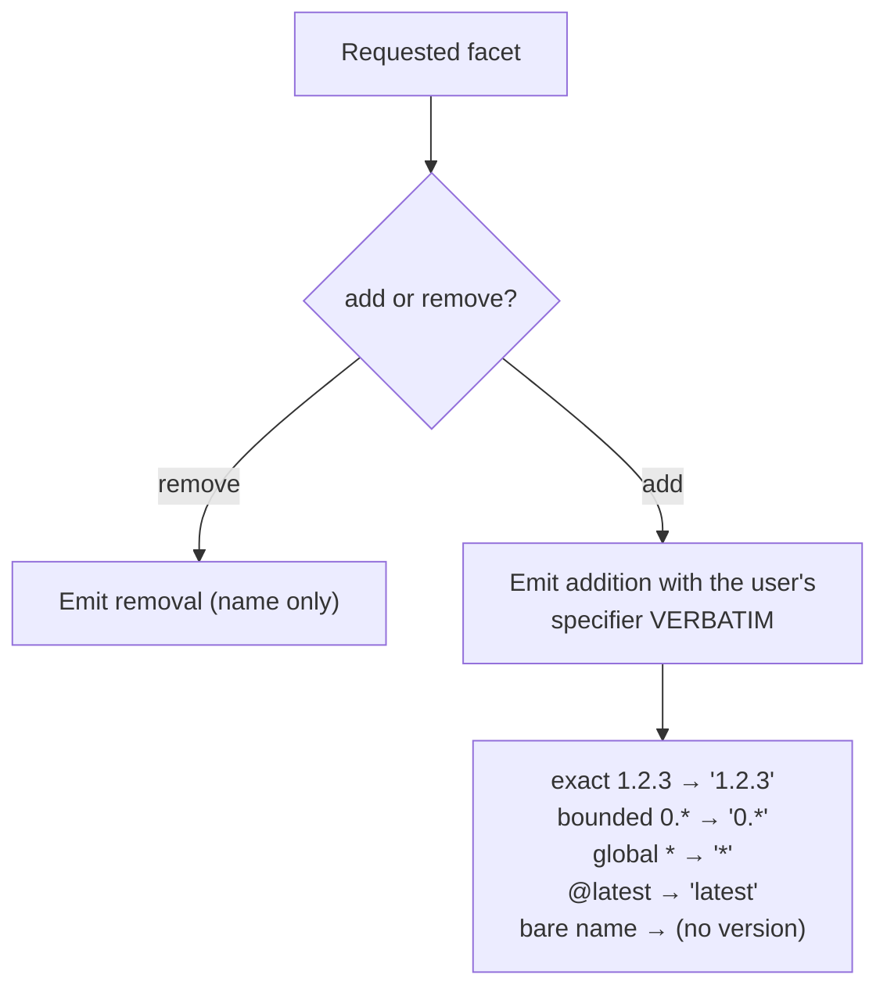

# Planning phase

The **plan** phase is pure routing. It turns a user request into a delta:

- **additions** — the facets the user explicitly asked to add, each carrying
  the **user's specifier verbatim** (exact `1.2.3`, bounded wildcard `0.*`,
  global `*`, `@latest`, or a bare name with no version)
- **removals** — bare facet names

Plan does **no network I/O, no lockfile lookups, no cache reads, and no
version resolution**. Its only job is to determine *what is changing* —
which facets are being added (and with what specifier the user typed) and
which are being removed. All resolution is the commit phase's job.

`facet install` carries **no request**, so it produces an **empty delta**
(no additions, no removals) and goes straight to commit, which reconciles
the existing manifest against the lockfile. Planning exists only because an
`add` or `remove` introduces an explicit change.

## Inputs and outputs

## Per-request routing (add / remove)

This section applies only to `add` and `remove`. A plain `install` has no
request to route.

The specifier is passed through untouched. Plan does not decide what version
a wildcard or `latest` resolves to, and does not look at the lockfile or the
cache to do so. That decision — and the manifest-write policy that pins a
bare name but keeps an explicit `@latest`/wildcard floating — belongs to
commit.

## Invariants

- Plan performs **no network calls, no lockfile reads, no cache reads, and no
  version resolution**. It is pure.
- An **addition carries the user's specifier verbatim**. Plan never rewrites,
  pins, or resolves it. (A bare name is carried as "no version" and is pinned
  later, by commit.)
- `install` produces an **empty delta**; it has no request to plan.
- The structural discriminator that commit relies on is established here:
  anything in **additions** is an explicit user request; anything commit
  later reads from the **manifest but not in additions** is reproduction.
